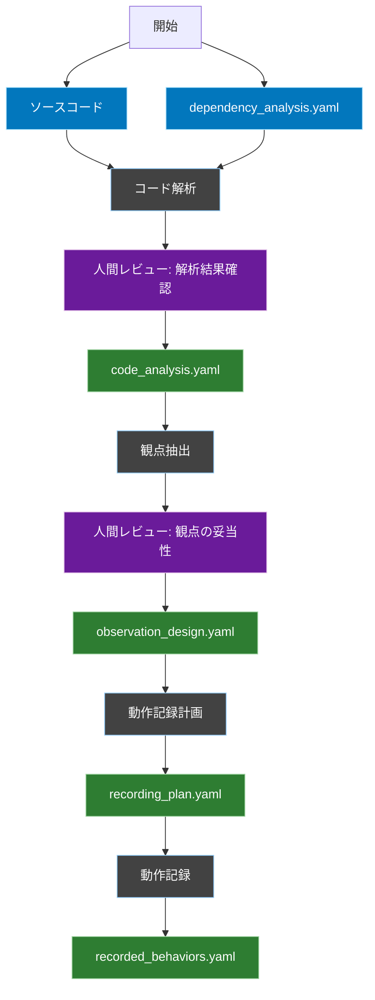
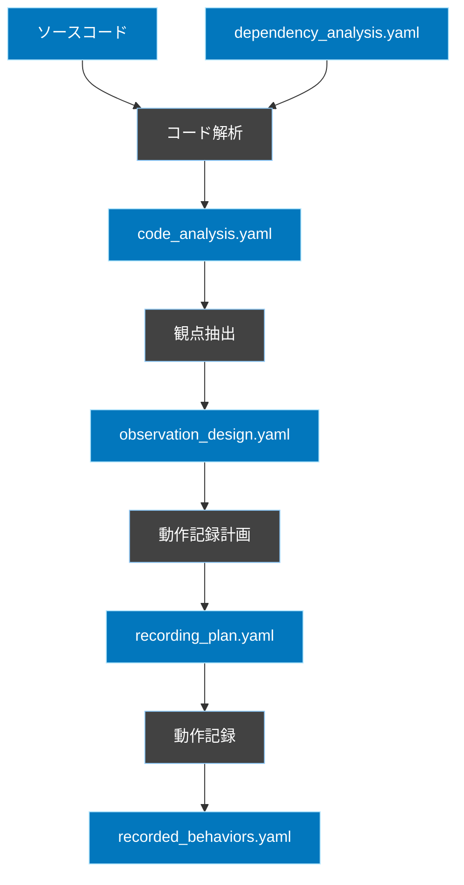

# ソースコード解析ベースの動作記録ワークフロー

## 概要
このワークフローは、実際のソースコードを解析することで既存システムの動作を正確に記録するためのプロセスを定義します。dependency_analysis.yaml は補助的な情報として活用しつつ、実際のコードの振る舞いを中心に据えて観点を抽出し、動作を記録します。

## ワークフロー全体図


## フェーズ間の依存関係


## 1. コード解析フェーズ

### 概要
dependency_analysis.yaml で特定された依存ブロックを起点に、Cursorのコード参照機能を利用して実装の重要な特徴を解析します。

### フェーズの流れ

1. **依存ブロックの特定と解析順序の決定**
   - dependency_analysis.yaml から密結合のコンポーネント群を特定
   - coupling_score などを参考に、解析順序を決定
   例：`TodoService` → `TagService` → `UserService` の順で解析

2. **コード参照による重要ポイントの特定**
   - 各依存ブロックについて、以下の重要な特徴を特定：
     1. キーとなるメソッドの抽出
        - パブリックメソッド
        - 他サービスから呼び出されるメソッド
        - 状態を変更するメソッド
     
     2. 各メソッドの重要な特徴を特定
        - 認証・認可要件
        - トランザクションの有無
        - 外部サービス呼び出し
     
     3. 重要な依存関係の特定
        - 他のサービスのメソッド呼び出し
        - 重要なユーティリティの使用
     
     4. クリティカルな分岐の特定
        - 認証・認可チェック
        - バリデーション
        - 重要なビジネスロジック
     
     5. 状態変更の特定
        - データベース操作
        - 外部システムの状態変更

3. **解析結果の記録**
   - 特定した重要ポイントを構造化して記録
   - 後続フェーズで必要となる情報に焦点を当てる

### 出力
- `FLOW/temp/code_analysis.yaml`

```yaml
# code_analysis.yaml の形式
dependency_blocks:
  todo_management:    # 依存ブロックの識別子
    entry_points:
      TodoService.store:    # 主要なメソッド
        key_points:    # このメソッドの重要な特徴
          - "requires authentication"
          - "database transaction"
          - "external service call"
        
        references:    # 重要な依存関係
          - "TagService.validateTags"
          - "UserService.checkPermission"
        
        critical_branches:    # 重要な分岐
          - condition: "permission check"
            error: "AuthenticationException"
          - condition: "tag validation"
            error: "ValidationException"
        
        state_changes:    # 状態変更
          - "todos: create"
          - "todo_tags: create"
```

## 2. 観点抽出フェーズ

### 概要
コード解析の結果から、実際の動作を記録するための具体的な観点を抽出します。コードの実装内容に基づいて、何をどのタイミングで記録すべきかを定義します。

### 入力
- `FLOW/temp/code_analysis.yaml`

### 処理内容
1. 記録ポイントの特定
   - メソッドの開始・終了時
   - 重要な分岐の前後
   - 状態変更の前後
   - 例外発生の可能性がある箇所

2. 記録項目の定義
   - 入力パラメータ
   - 中間状態
   - 分岐結果
   - エラー情報
   - 最終結果

3. 実行パターンの定義
   - 正常系フロー
   - 異常系フロー
   - エッジケース

### 出力
- `FLOW/temp/observation_design.yaml`

### 出力ファイル形式
```yaml
observation_design:
  # メソッド単位の観点定義
  methods:
    TodoService.store:
      capture_points:
        - timing: "method_entry"
          items:
            - name: "input_data"
              type: "request_params"
            - name: "auth_status"
              type: "system_state"
        
        - timing: "before_validation"
          items:
            - name: "validation_rules"
              type: "validation_config"
        
        - timing: "after_validation"
          items:
            - name: "validation_result"
              type: "validation_output"
            - name: "validation_errors"
              type: "error_details"
        
        - timing: "before_save"
          items:
            - name: "todo_model"
              type: "model_state"
            - name: "tags_to_attach"
              type: "relation_data"
        
        - timing: "after_save"
          items:
            - name: "saved_todo"
              type: "model_state"
            - name: "attached_tags"
              type: "relation_state"
      
      execution_patterns:
        normal_flow:
          - description: "正常なTodo作成"
            conditions:
              - "valid_input"
              - "authenticated_user"
          
        error_flows:
          - description: "バリデーションエラー"
            conditions:
              - "invalid_input"
          - description: "認証エラー"
            conditions:
              - "unauthenticated_user"
```

## 3. 動作記録計画フェーズ

### 概要
観点設計に基づいて、実際の動作記録をどのように実施するかの具体的な計画を策定します。

### 入力
- `FLOW/temp/observation_design.yaml`

### 処理内容
1. 記録シナリオの構築
   - 観点ごとの実行手順を定義
   - テストデータの準備要件を特定
   - 環境要件を定義

2. キャプチャ方式の設計
   - ログ出力の設定
   - デバッグ情報の収集方法
   - 状態スナップショットの取得タイミング

3. エラー処理の計画
   - 異常系シナリオの実行手順
   - エラー状態の記録方法
   - リカバリー手順の定義

### 出力
- `FLOW/temp/recording_plan.yaml`

### 出力ファイル形式
```yaml
recording_plan:
  scenarios:
    todo_creation:
      normal_case:
        setup:
          - action: "prepare_test_user"
            data: 
              email: "test@example.com"
              password: "password123"
          - action: "prepare_test_tags"
            data:
              tags: ["work", "urgent"]
        
        steps:
          - description: "ユーザー認証"
            action: "authenticate"
            capture:
              - auth_status
              - session_info
          
          - description: "Todo作成リクエスト"
            action: "create_todo"
            data:
              title: "テストTodo"
              description: "説明文"
              tags: ["work", "urgent"]
            capture:
              - request_params
              - validation_result
              - model_state
              - db_queries
        
        assertions:
          - type: "model_created"
            target: "Todo"
          - type: "relations_synced"
            target: "tags"
      
      validation_error_case:
        setup:
          - action: "prepare_test_user"
            data:
              email: "test@example.com"
        
        steps:
          - description: "不正なTodo作成リクエスト"
            action: "create_todo"
            data:
              title: ""  # バリデーションエラーを発生させる
            capture:
              - validation_errors
              - error_response
  
  capture_config:
    log_level: "debug"
    save_queries: true
    record_timestamps: true
    snapshot_format: "yaml"
```

## 4. 動作記録フェーズ

### 概要
策定された計画に基づいて、実際のシステムの動作を記録します。

### 入力
- `FLOW/temp/recording_plan.yaml`

### 処理内容
1. 環境セットアップ
   - テストデータの準備
   - ログ設定の適用
   - 必要なモックの設定

2. シナリオ実行
   - 計画された手順の実行
   - キャプチャポイントでのデータ収集
   - エラーケースの実行

3. 記録データの整理
   - 収集データの構造化
   - タイムスタンプの付与
   - トレーサビリティの確保

### 出力
- `FLOW/output/recorded_behaviors.yaml`

### 出力ファイル形式
```yaml
recorded_behaviors:
  scenario_results:
    todo_creation:
      normal_case:
        timestamp: "2024-03-15T10:30:00Z"
        execution_status: "success"
        captured_data:
          method_entry:
            auth_status:
              user_id: 1
              authenticated: true
            input_data:
              title: "テストTodo"
              description: "説明文"
              tags: ["work", "urgent"]
          
          validation:
            result: "passed"
            applied_rules:
              title: ["required", "string", "max:255"]
          
          model_creation:
            todo:
              id: 1
              title: "テストTodo"
              user_id: 1
              created_at: "2024-03-15T10:30:00Z"
            
            relations:
              tags:
                - id: 1
                  name: "work"
                - id: 2
                  name: "urgent"
          
          queries:
            - type: "insert"
              table: "todos"
              duration_ms: 5
            - type: "insert"
              table: "todo_tag"
              duration_ms: 3
      
      validation_error_case:
        timestamp: "2024-03-15T10:31:00Z"
        execution_status: "expected_error"
        captured_data:
          validation:
            result: "failed"
            errors:
              title: ["The title field is required."]
          
          response:
            status: 422
            body:
              message: "The given data was invalid."
              errors:
                title: ["The title field is required."]
```

## レビューポイント定義

### コード解析結果の確認（Review0）
- 解析の網羅性
  - すべての重要なメソッドが解析されているか
  - 分岐条件の抽出が十分か
  - データフローの追跡が適切か
- 依存関係の具体性
  - 実コードでの依存の使われ方が明確か
  - 相互作用パターンが具体的か

### 観点の妥当性（Review1）
- 記録ポイントの適切性
  - 重要な処理の前後で記録されるか
  - 状態変更を確実に捕捉できるか
- 記録項目の十分性
  - 必要な情報が漏れなく含まれているか
  - エラー状態の把握に十分か

## レビュー実施のガイドライン
1. 各レビューでは、実装の詳細に基づいて判断
2. コードの振る舞いと記録内容の整合性を重視
3. レビュー結果は`review_logs.yaml`に記録

```yaml
review_checkpoint:
  timing: "各フェーズ完了後"
  required_roles:
    - テックリード
    - アーキテクト
  focus_points:
    - "実装詳細との整合性"
    - "記録の網羅性"
    - "実行可能性"
  output:
    format: yaml
    location: "FLOW/review_logs.yaml"
``` 