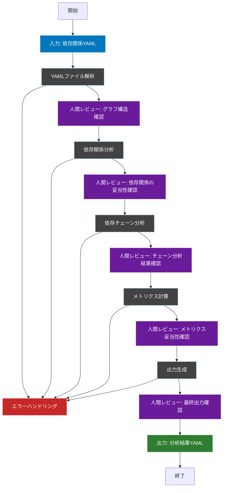
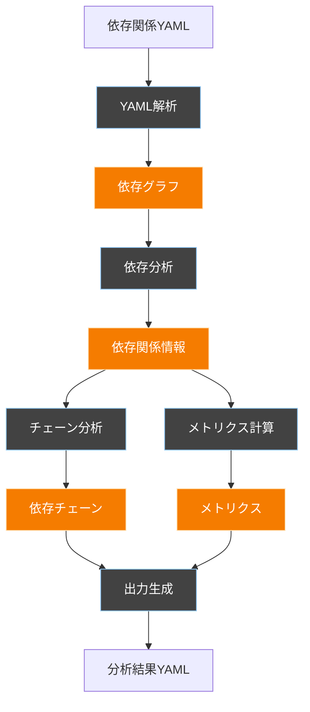

# 依存性分析ワークフロー

## 概要
このワークフローは、Laravelプロジェクトの依存関係を分析し、仕様化テスト計画に必要な情報を抽出・構造化します。Cursorエージェントによって自動実行されることを前提に設計されています。

## ワークフロー全体図


## フェーズ間の依存関係


## ワークフローの目的
1. 依存関係の構造を理解可能な形で分析
2. テスト計画に必要な依存情報の抽出
3. 依存関係に基づくテスト優先度の判断材料の提供

## 前提条件
- Laravelプロジェクトのソースコード
- 依存関係を記述したYAMLファイル

## 1. YAMLファイル解析フェーズ

### 概要
入力されたYAMLファイルを解析し、依存関係グラフを構築します。

### 入出力
- 入力: `dependency.yaml`（ユーザー提供）
- 出力: `FLOW/temp/parsed_dependencies.yaml`

### 重要なポイント
- ファイルパスの正規化
- コンポーネントの種類分類
- 依存関係の方向性の保持

### 1.1 依存関係グラフの構築


### 1.2 グラフ構築ルール
```yaml
graph_construction:
  node_types:
    - CONTROLLER
    - SERVICE
    - MODEL
    - POLICY
    - VIEW
    - PROVIDER
  edge_types:
    - USES
    - IMPLEMENTS
    - EXTENDS
  classification_rules:
    CONTROLLER: 
      - pattern: "app/Http/Controllers/*.php"
    SERVICE:
      - pattern: "app/Services/*.php"
    MODEL:
      - pattern: "app/Models/*.php"
```

## 2. 依存関係分析フェーズ

### 概要
構築されたグラフから、直接依存、間接依存、循環依存を分析します。

### 入出力
- 入力: `FLOW/temp/parsed_dependencies.yaml`
- 出力: `FLOW/temp/analyzed_dependencies.yaml`

### 分析の焦点
- コンポーネント間の関係性
- 依存の深さと方向
- 問題となる可能性のある循環参照

### 2.1 直接・間接依存の分析
```yaml
dependency_analysis:
  direct_dependencies:
    detection:
      - namespace_imports
      - class_usage
      - method_calls
  indirect_dependencies:
    max_depth: 3
    detection:
      - transitive_dependencies
      - service_locator_usage
```

### 2.2 循環参照検出
```yaml
circular_detection:
  algorithm: "tarjan"
  max_cycle_length: 5
  ignore_patterns:
    - "*/tests/*"
```

## 3. 依存チェーン分析フェーズ

### 概要
特定のパターンに基づいて、重要な依存チェーンを特定します。

### 入出力
- 入力: `FLOW/temp/analyzed_dependencies.yaml`
- 出力: `FLOW/temp/dependency_chains.yaml`

### チェーン分析のポイント
- ビジネスロジックの流れ
- 認可フロー
- データアクセスパターン

### 3.1 主要フロー特定
```yaml
chain_analysis:
  main_flows:
    patterns:
      - "CONTROLLER -> SERVICE -> MODEL"
      - "CONTROLLER -> POLICY -> MODEL"
  chain_types:
    - MAIN_FLOW
    - AUTHORIZATION
    - EVENT_HANDLING
```

### 3.2 チェーン分類ルール
```yaml
chain_classification:
  rules:
    MAIN_FLOW:
      - contains: ["SERVICE"]
      - ends_with: ["MODEL"]
    AUTHORIZATION:
      - contains: ["POLICY"]
      - contains: ["User.php"]
```

## 4. メトリクス計算フェーズ

### 概要
依存関係の複雑さを定量化します。

### 入出力
- 入力: `FLOW/temp/dependency_chains.yaml`
- 出力: `FLOW/temp/calculated_metrics.yaml`

### メトリクスの意味
- 直接依存度：直接的な結合の強さ
- 間接依存度：波及効果の大きさ
- 循環依存度：保守性への影響

### 4.1 依存度の計算
```yaml
metrics_calculation:
  coupling:
    direct_weight: 1
    indirect_weight: 0.5
    circular_weight: 2
```

## 5. 出力生成フェーズ

### 概要
分析結果を次のフェーズで利用可能な形式に変換します。

### 入出力
- 入力: `FLOW/temp/calculated_metrics.yaml`
- 出力: `FLOW/output/dependency_analysis.yaml`

### 出力の重要性
- テスト計画での利用
- 依存関係の可視化
- 問題箇所の特定

### 5.1 コンポーネント分析結果の生成
```yaml
output_generation:
  format: "yaml"
  sections:
    - dependencies
    - dependency_chains
    - metrics
  required_fields:
    - component
    - type
    - relationship
```

## 6. エラーハンドリング

### 概要
処理中に発生する可能性のあるエラーへの対処方法を定義します。

### エラーハンドリングの方針
- 致命的エラー：処理を中断
- 警告レベル：記録して継続
- リソース制約：適切な縮退運転

## 実行時の注意事項

### メモリ管理
- 大規模プロジェクトでのメモリ使用量に注意
- 必要に応じてグラフの分割処理を検討

### エラー発生時の対応
1. ログの確認
2. エラーの種類の特定
3. 定義された対応方針の実行

### 出力の検証
- 結果のフォーマット確認
- 依存関係の整合性確認
- メトリクスの妥当性確認

## 制限事項
1. 最大処理可能なノード数：10,000
2. 循環参照の最大検出深さ：5
3. 間接依存の追跡深さ：3

## 次フェーズへの連携
- 分析結果は`FLOW/output/dependency_analysis.yaml`に出力
- テスト計画フェーズでこの結果を入力として使用
- 重要な依存関係情報が欠落していないことを確認

## レビューポイント定義

### グラフ構造確認（Review1）
- 全てのコンポーネントが正しく認識されているか
- 依存関係の方向が正しいか
- 不要なノードや関係が含まれていないか

### 依存関係の妥当性確認（Review2）
- 直接依存関係が実装と一致しているか
- 循環参照が実際に問題となるものか
- 見落としている重要な依存関係はないか

### チェーン分析結果確認（Review3）
- ビジネスフローが正しく特定されているか
- 重要な処理パスが漏れていないか
- チェーンの分類が適切か

### メトリクス妥当性確認（Review4）
- 計算された複雑度は実感と一致するか
- 異常値や不自然な値はないか
- 優先度判断の基準として適切か

### 最終出力確認（Review5）
- 分析結果が次フェーズで活用可能な形式か
- 重要な情報が欠落していないか
- 全体的な整合性は取れているか

## レビュー実施のガイドライン
1. 各レビューポイントでは「承認」または「差し戻し」を明確に判断
2. 差し戻しの場合は具体的な修正指示を記録
3. レビュー結果は`review_logs.yaml`に記録

```yaml
review_checkpoint:
  timing: "各フェーズ完了後"
  required_roles:
    - テックリード
    - アーキテクト
  output:
    format: yaml
    location: "FLOW/review_logs.yaml"
  decision:
    options:
      - APPROVED
      - REJECTED
    required_fields:
      - reviewer
      - timestamp
      - comments
      - decision
```