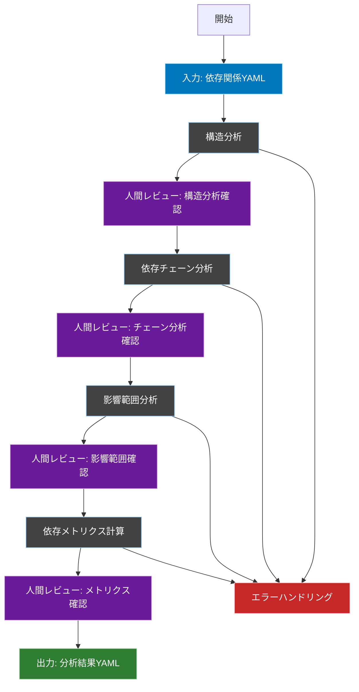
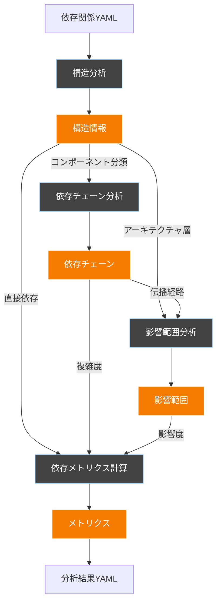

# 依存性分析ワークフロー

## 概要
このワークフローは、Laravelプロジェクトの依存関係を分析し、テスト計画に必要な客観的な判断材料を提供します。Cursorエージェントによって自動実行されることを前提に設計されています。

## ワークフロー全体図


## フェーズ間の依存関係


## 1. 構造分析フェーズ

### 概要
コンポーネント間の直接的な依存関係を分析し、アーキテクチャ上の役割と位置づけを特定します。

### 入力
- `FLOW/input/dependency.yaml`

### 処理内容
1. **コンポーネントの分類**
   - コンポーネントの種類（CONTROLLER, SERVICE, REPOSITORY等）を特定
   - アーキテクチャ層（APPLICATION, DOMAIN, INFRASTRUCTURE等）への分類
   - テストの種類（Unit/Integration）判断のための基礎情報として活用

2. **依存関係の強度評価**
   - 直接依存の種類（メソッド呼び出し、型参照等）を分析
   - 依存の強さ（strong/weak）を判定
   - モック化の必要性判断のための情報として活用

3. **アーキテクチャ構造の把握**
   - レイヤー間の依存関係を確認
   - クリーンアーキテクチャ等の原則との整合性を評価
   - テストの範囲と方針決定のための情報として活用

### 出力
- `FLOW/temp/structure_analysis.yaml`

### 出力ファイル形式
```yaml
# 構造分析フェーズの出力。コンポーネント間の直接的な依存関係と役割を定義します。
structure_analysis:
  components:
    - name: "TodoController"
      # コンポーネントの種類：テストの種類（Unit/Integration）の判断に使用
      type: "CONTROLLER"
      # アーキテクチャ層：テストの範囲と方針の決定に使用
      layer: "APPLICATION"
      # 直接依存：モック化の必要性とテストの境界を判断
      direct_dependencies:
        - component: "TodoService"
          type: "strong"          # 依存の強さ：テストの詳細度を判断
          reason: "メソッド呼び出し頻度が高い"
        - component: "Todo"
          type: "weak"            # 弱い依存：モック化の候補
          reason: "型定義のみの参照"
```

## 2. 依存チェーン分析フェーズ

### 概要
依存関係の連鎖を追跡し、主要な処理フローを特定します。

### 入力
- `FLOW/temp/structure_analysis.yaml`

### 処理内容
1. **依存チェーンの追跡**
   - コンポーネント間の依存関係を連鎖的に追跡
   - 主要なビジネスフロー（例：Todo作成フロー）を特定
   - 循環参照の検出と記録

2. **フロータイプの分類**
   - ビジネスフローの重要度を評価
   - 複雑さの定量化（依存チェーンの長さ、分岐の数等）
   - テストシナリオ設計の優先度判断材料として活用

3. **テスト境界の特定**
   - 統合テストが必要な範囲を特定
   - モック化可能な境界を判定
   - テストの詳細度判断のための情報として活用

### 出力
- `FLOW/temp/dependency_chains.yaml`

### 出力ファイル形式
```yaml
# 依存チェーン分析フェーズの出力。処理フローとその特性を定義します。
dependency_chains:
  flows:
    - name: "Todo作成フロー"
      # チェーン：統合テストのシナリオ設計に使用
      chain: ["TodoController", "TodoService", "Todo", "Tag"]
      # フロータイプ：テストの重要度判断に使用
      type: "main_business_flow"
      # 複雑さ：テストの詳細度と優先度の判断に使用
      complexity: "high"
      # 循環参照：テスト実装時の注意点として使用
      cycles_detected: false
```

## 3. 影響範囲分析フェーズ

### 概要
コンポーネントの変更が他に与える影響を分析します。

### 入力
- `FLOW/temp/structure_analysis.yaml`
- `FLOW/temp/dependency_chains.yaml`

### 処理内容
1. **影響範囲の特定**
   - 各コンポーネントが影響を与える範囲を追跡
   - 影響を受ける範囲を特定
   - テストデータの準備範囲決定に活用

2. **リスク領域の評価**
   - データ整合性、APIレスポンス等のリスク領域を特定
   - 変更影響度のレベル分け
   - テストケース設計方針の決定材料として活用

3. **テスト範囲の最適化**
   - 影響範囲に基づくテスト範囲の決定
   - 重点的なテストが必要な領域の特定
   - テストの優先順位付けに活用

### 出力
- `FLOW/temp/impact_analysis.yaml`

### 出力ファイル形式
```yaml
# 影響範囲分析フェーズの出力。変更の影響と重要な観点を定義します。
impact_analysis:
  components:
    - name: "TodoService"
      # 影響を受ける要素：テストデータの準備範囲を決定
      affected_by: ["Todo", "Tag"]
      # 影響を与える要素：テストの検証範囲を決定
      affects: ["TodoController", "API"]
      # 影響レベル：テストの優先度と詳細度を判断
      change_impact_level: "high"
      # リスク領域：テストケースの設計方針を決定
      risk_areas:
        - "データ整合性"
        - "APIレスポンス"
```

## 4. 依存メトリクス計算フェーズ

### 概要
依存関係の定量的な評価を行います。

### 入力
- `FLOW/temp/structure_analysis.yaml`
- `FLOW/temp/dependency_chains.yaml`
- `FLOW/temp/impact_analysis.yaml`

### 処理内容
1. **メトリクスの計算**
   - 結合度（coupling_score）の計算
   - 安定性（stability_index）の評価
   - 複雑さ（complexity_score）の定量化
   - テスト優先度（test_priority_score）の算出

2. **総合評価の実施**
   - 各メトリクスの重み付け
   - 総合的なテスト優先度の決定
   - テストの詳細度判断材料として活用

3. **テスト要件の具体化**
   - カバレッジ要件の設定
   - テストデータ要件の特定
   - テスト実装方針の決定材料として活用

### 出力
- `FLOW/output/dependency_analysis.yaml`

### 出力ファイル形式
```yaml
dependency_analysis:
  components:
    - name: "TodoService"
      # メトリクス情報：テストの優先度と重要度の判断に使用
      metrics:
        coupling_score: 0.8        # 他コンポーネントとの結合度
        stability_index: 0.6       # コンポーネントの安定性
        complexity_score: 0.7      # コードの複雑さ
        test_priority_score: 0.85  # テスト優先度の総合評価

      # 構造情報：テストの種類と観点の決定に使用
      structure:
        type: "SERVICE"            # コンポーネントの種類
        layer: "APPLICATION"       # アーキテクチャ層
        direct_dependencies:       # 直接の依存関係
          - "TodoRepository"
          - "EventDispatcher"

      # 依存チェーン：テストシナリオとフローの設計に使用
      dependency_chains:
        - chain: ["TodoController", "TodoService", "Todo"]
          type: "main_business_flow"
          complexity: "high"
          cycles_detected: false

      # 影響範囲：テストスコープとデータ要件の決定に使用
      impact_analysis:
        affected_by: ["Todo", "Tag"]  # このコンポーネントに影響を与えるもの
        affects: ["TodoController"]   # このコンポーネントが影響を与えるもの
        risk_level: "high"           # 変更による影響度
        risk_areas:                  # 特に注意が必要な領域
          - "データ整合性"
          - "APIレスポンス"
```

## レビューポイント定義

### 構造分析確認（Review1）
- コンポーネントの分類は適切か
- 依存関係の強さの判定は妥当か
- アーキテクチャ層の特定は正しいか

### チェーン分析確認（Review2）
- 主要な処理フローが漏れなく特定されているか
- チェーンの複雑さの評価は適切か
- ビジネスフローとの対応が取れているか

### 影響範囲確認（Review3）
- 影響範囲の特定は十分か
- 変更影響度の評価は適切か
- 重要な依存関係が見落とされていないか

### メトリクス確認（Review4）
- スコアの計算は適切か
- 異常値や不自然な値はないか
- テスト優先度の判断基準として妥当か

## レビュー実施のガイドライン
```yaml
review_checkpoint:
  timing: "各フェーズ完了後"
  required_roles:
    - テックリード
    - アーキテクト
  output:
    format: yaml
    location: "FLOW/review_logs.yaml"
  decision:
    options:
      - APPROVED
      - REJECTED
    required_fields:
      - reviewer
      - timestamp
      - comments
      - decision
```