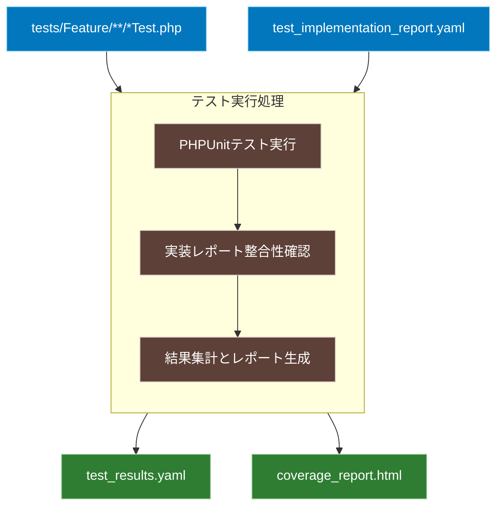

# 仕様化テスト実行ワークフロー

## 概要
実装されたテストコードを実行し、その結果と実装レポートの整合性を確認します。また、コードカバレッジ情報を収集・分析します。

## ワークフロー全体図


## 入力
1. テストコード
   - `tests/Feature/**/*Test.php`
   - PHPUnitで実行可能な形式のテストファイル群

2. 実装レポート
   - `FLOW/output/test_implementation_report.yaml`
   - 実装されたテストケースの情報と期待される実行結果

## 処理内容
1. PHPUnitテスト実行
   - テストの実行
     ```bash
     vendor/bin/phpunit \
       --testdox \                # 読みやすい形式でテスト結果を出力
       --coverage-html coverage \ # HTMLカバレッジレポートを生成
       --log-junit test-results.xml  # JUnit形式でテスト結果を出力
     ```
   - 実行結果の収集
   - カバレッジ情報の収集

2. 実装レポート整合性確認
   - テストケース数の一致確認
   - テストメソッド名の命名規則確認
   - 優先度に基づく実行順序の検証
   - 実行結果と期待結果の比較

3. 結果集計とレポート生成
   - テスト実行結果の構造化（`test_results.yaml`）
     ```yaml
     test_execution:
       timestamp: "2024-03-20T10:30:00Z"
       summary:
         total_tests: 15
         passed: 14
         failed: 1
         skipped: 0
       
       test_cases:
         - name: "test_successful_login_maintains_recorded_behavior"
           status: "passed"
           duration: "0.123s"
           assertions: 3
           
         - name: "test_invalid_login_maintains_recorded_behavior"
           status: "failed"
           duration: "0.089s"
           assertions: 3
           error:
             message: "Failed asserting response status..."
             trace: [...]
       
       implementation_verification:
         matching_rate: 93.3%  # 実装レポートとの一致率
         missing_tests: []
         unexpected_tests: []
         naming_violations: []
     ```
   - カバレッジ情報の集計（`coverage_report.html`）
     - 行カバレッジ
     - 分岐カバレッジ
     - 関数カバレッジ
     - 未カバー箇所のハイライト

## 出力
- テスト実行結果（`FLOW/output/test_results.yaml`）
- カバレッジレポート（`FLOW/output/coverage_report.html`） 