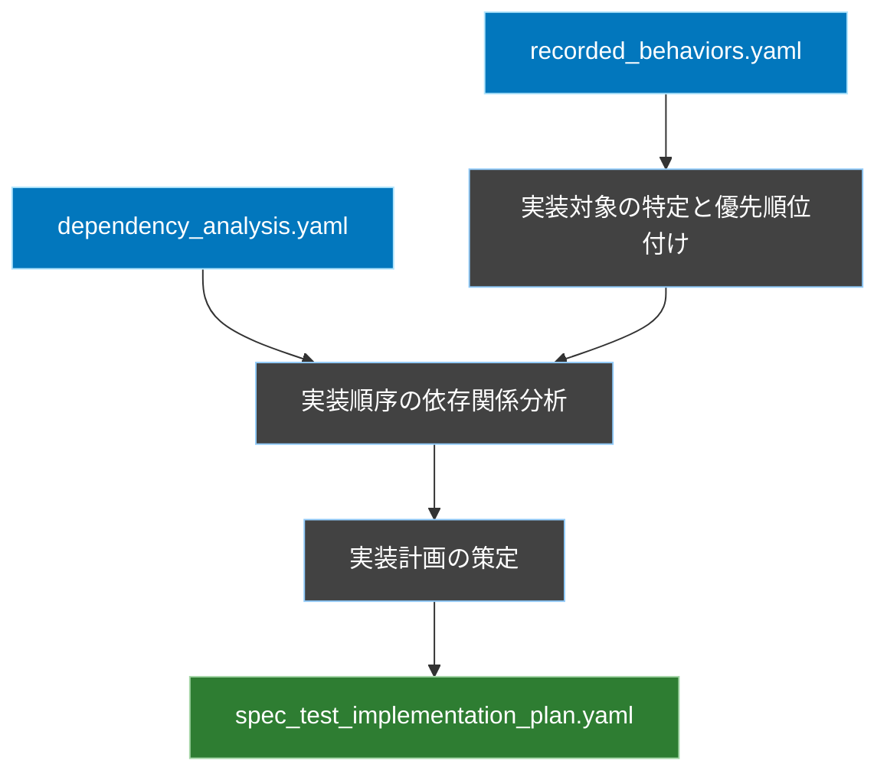
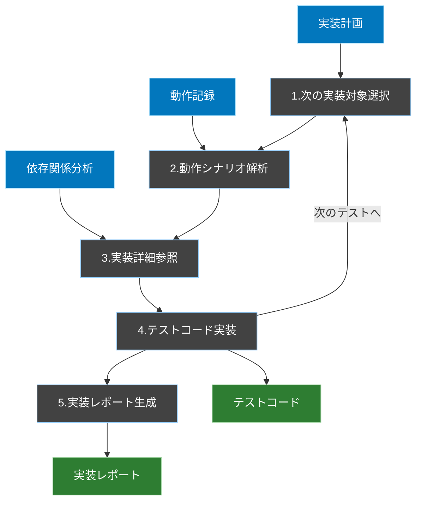

# 仕様化テスト実装ワークフロー

## 概要
実装計画、動作記録、および依存関係分析を主要な入力として、既存の動作を保証する仕様化テストコードを実装します。依存関係分析は、実装内容の確認が必要な際の参照マップとしても活用します。

## 1. 実装計画策定フェーズ


### 入力
1. `FLOW/output/dependency_analysis.yaml`（依存関係分析）
   - コンポーネント間の関係性の定義
   - 実装コード参照のためのマップ情報
   - テスト分離の境界定義

2. `FLOW/output/recorded_behaviors.yaml`（動作記録）
   - 期待される出力の定義
   - 実際の動作シナリオ
   - 入力と出力の関係

### 処理内容

1. **実装対象の特定と優先順位付け**
   - recorded_behaviors.yamlから実装対象となる動作を特定
   - 以下の観点で優先順位を評価：
     - ビジネス上の重要度
     - 技術的な依存関係
     - リスク要因

2. **実装順序の依存関係分析**
   - dependency_analysis.yamlを参照し、コンポーネント間の依存関係を確認
   - テスト実装の技術的な前提条件を特定
   - 実装順序の制約を決定

3. **実装計画の策定**
   - 上記の情報を総合的に活用して、実装計画を策定
   - テスト構造の決定
   - テストケースの実装

### 出力
- `FLOW/output/spec_test_implementation_plan.yaml`

### 出力ファイル形式
```yaml
spec_test_implementation_plan:
  # 実装対象と優先順位
  implementation_targets:
    - priority: 1
      scenario_id: "user_registration"  # recorded_behaviors.yamlのシナリオ名
      components:  # dependency_analysis.yamlの関連コンポーネント
        primary: "UserService"
        dependencies: ["UserRepository"]
      reason: "コアビジネスフロー"
      behavior_path: "scenarios[name=user_registration]"  # 動作記録内の参照パス
    
    - priority: 2
      scenario_id: "user_authentication"
      components:
        primary: "AuthService"
        dependencies: []
      reason: "セキュリティ要件"
      behavior_path: "scenarios[name=user_authentication]"
    
    - priority: 3
      scenario_id: "password_reset"
      components:
        primary: "UserService"
        dependencies: ["MailService"]
      reason: "ユーザーサポート機能"
      behavior_path: "scenarios[name=password_reset]"

  # 実装順序の依存関係
  dependencies:
    - target: "user_authentication"
      requires: ["user_registration"]
      reason: "認証にはユーザーの存在が必要"
    
    - target: "password_reset"
      requires: ["user_registration"]
      reason: "パスワードリセットにはユーザーの存在が必要"
```

## 2. 仕様化テスト実装フェーズ


### 入力
1. `FLOW/output/spec_test_implementation_plan.yaml`（実装計画）

2. `FLOW/output/recorded_behaviors.yaml`（動作記録）

3. `FLOW/output/dependency_analysis.yaml`（依存関係分析）

### 処理内容

#### テスト実装ループ（1-4を繰り返し）
1. **次の実装対象を選択** (spec_test_implementation_plan.yaml)
   - 優先順位の高い未実装テストを選択
   - 依存関係の制約を確認
```yaml
# spec_test_implementation_plan.yamlから参照
implementation_targets:
  - scenario_id: "user_registration"    # 実装対象のID
    priority: 1                         # 優先順位
    behavior_path: "scenarios[0]"       # recorded_behaviors.yaml内の参照パス
    components:                         # dependency_analysis.yaml内の参照情報
      primary: "UserService"
      dependencies: ["UserRepository"]
```

2. **動作シナリオを解析** (recorded_behaviors.yaml)
   - 対象シナリオの動作を確認
   - 入力データと期待結果を抽出
   - システムの初期状態を特定
   - 副作用（データベース変更等）を把握
```yaml
# recorded_behaviors.yamlから参照
scenarios:
  - id: "user_registration"
    context:                           # システムの初期状態
      database:
        users: []
    input_data:                        # テストの入力値
      email: "test@example.com"
      password: "password123"
    observed_behavior:                 # 期待される動作
      - step: "validate_input"
        result: "valid"
      - step: "create_user"
        result: "success"
    final_state:                       # 期待される最終状態
      database:
        users:
          - email: "test@example.com"
    side_effects:                      # 観測された副作用
      - type: "email"
        action: "welcome_mail_sent"
```

3. **実装詳細を参照** (dependency_analysis.yaml)
   - 実装コードの場所を特定
   - 関連するコンポーネントの相互作用を理解
   - テスト実行に必要な環境条件を特定
```yaml
# dependency_analysis.yamlから参照
components:
  UserService:
    implementation_path: "app/Services/UserService.php"
    public_methods:
      - name: "register"
        parameters: ["email", "password"]
    dependencies:
      UserRepository:
        type: "required"
        interaction_points:
          - method: "findByEmail"
          - method: "save"
    environment_requirements:
      - "database_connection"
      - "mail_server_access"
```

4. **テストコードを実装**
   - テストメソッドの作成
   - テストの意図と背景を明確にするコメント記述
   - システムの初期状態を準備（実データを使用）
   - 状態変化の検証
   - 副作用の確認

#### 実装レポート生成（全テスト実装完了後）
5. **実装レポートの作成**
   - 実装計画の達成状況
   - 各テストの実装結果
   - 発見された実装の特徴や制約
   - システムの振る舞いに関する新しい発見
   - 今後のリファクタリングに向けた示唆

### 出力

1. テストコード
- 場所：`tests/Feature/` 配下
- 形式：PHPUnit テストケース

#### 出力形式
```php
/**
 * ユーザー登録機能の仕様化テスト
 * 
 * このテストは既存の実装の振る舞いを仕様として記録するものです。
 * 参照動作記録: RB001（user_registration_basic_flow）
 * 
 * 前提条件：
 * - システムに既存ユーザーが存在する状態
 * - メールサーバーが応答可能な状態
 * 
 * 検証項目：
 * - ユーザー登録処理の完了
 * - データベースへの保存状態
 * - 関連する副作用（メール送信等）
 */
class UserRegistrationTest extends TestCase
{
    /**
     * 基本的なユーザー登録フローのテスト
     * 
     * このテストケースは、最も一般的なユーザー登録シナリオを検証します。
     * 実際の本番環境での動作を忠実に再現することを目的としています。
     */
    public function test_user_can_register()
    {
        // 1. システムの初期状態を記録
        $initialUserCount = User::count();
        $initialMailCount = $this->getMailCount();

        // 2. テスト実行
        $response = $this->post('/register', [
            'email' => 'test@example.com',
            'password' => 'password123'
        ]);

        // 3. システムの状態変化を検証
        $this->assertDatabaseHas('users', [
            'email' => 'test@example.com'
        ]);
        $this->assertEquals($initialUserCount + 1, User::count());
        
        // 4. 副作用の検証
        $this->assertEquals($initialMailCount + 1, $this->getMailCount());
        
        // 5. レスポンスの検証
        $response->assertStatus(200);
    }
}
```

2. 実装レポート
- 場所：`FLOW/output/test_implementation_report.yaml`
- 形式：YAML

#### 出力形式
```yaml
test_implementation_report:
  summary:
    total_scenarios: 10
    implemented: 10
    coverage: 100%
    
  implemented_tests:
    - scenario_id: "user_registration"
      status: "completed"
      test_file: "tests/Feature/UserRegistrationTest.php"
      coverage:
        behavior: "fully_covered"
        dependencies: "all_verified"
      notes: "全ての動作シナリオを網羅"
    
  implementation_notes:
    key_findings:
      - "未文書化の副作用の発見"
      - "システムの実際の依存関係の把握"
    refactoring_suggestions:
      - "メール送信処理の分離検討"
      - "トランザクション範囲の最適化"
```

## 注意事項
1. テストの目的は「既存の実装が持つ動作の保証」であることを常に意識する
2. 実装が持つ現在の動作を正確に理解し、忠実に検証する