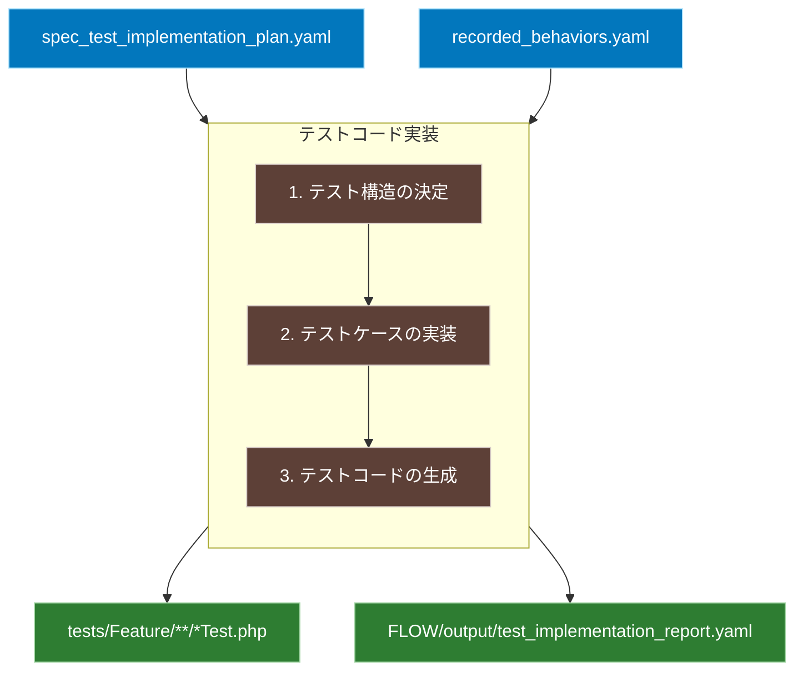

# 仕様化テスト実装ワークフロー

## 概要
実装計画と動作記録に基づいて、仕様化テストコードを実装します。

## ワークフロー全体図


## 入力
- `FLOW/output/spec_test_implementation_plan.yaml`（実装計画）
- `FLOW/output/recorded_behaviors.yaml`（動作記録）

## 処理内容
1. 実装計画からテスト構造を決定
   - 実装計画の `implementation_strategy.test_structure` に基づき、テストクラスを配置
     ```yaml
     implementation_strategy:
       test_structure:
         feature_tests:
           - "App\\Tests\\Feature\\Auth\\AuthenticationTest"  # このパスでクラスを生成
           - "App\\Tests\\Feature\\Todo\\TodoManagementTest"
     ```
   - 実装計画の `priorities` に基づき、テストの優先順位を反映

2. 各優先度のテストケースを実装
   - 実装計画の `priorities.*.test_cases` の各エントリに対して：
     ```yaml
     priorities:
       high:
         - component: "AuthController"
           test_cases:
             - name: "正常な認証フロー"
               observed_behavior: "recorded_behaviors.yaml#AuthController.正常な認証情報での認証"
     ```
   - `observed_behavior` の参照規則：
     - ファイル名#コンポーネント名.シチュエーション名
     - 例：`recorded_behaviors.yaml#AuthController.正常な認証情報での認証`
     - この参照から動作記録の該当エントリを特定

3. 動作記録からテストコードを生成
   a. 正常系のケース
   ```php
   public function test_successful_login_maintains_recorded_behavior()
   {
       // 1. 初期状態の準備
       $user = User::factory()->create([
           'email' => 'test@example.com',
           'password' => Hash::make('password123')
       ]);

       // 2. 記録された操作の実行
       $response = $this->post('/login', [
           'email' => 'test@example.com',
           'password' => 'password123'
       ]);

       // 3. 実装計画のアサーションに基づく検証
       $response->assertStatus(200);
       $response->assertRedirect('/todos');
       $this->assertAuthenticated();
   }
   ```

   b. エラーケースの例
   ```php
   public function test_invalid_login_maintains_recorded_behavior()
   {
       // 1. エラーケースの初期状態
       $user = User::factory()->create();

       // 2. 記録された無効な操作の実行
       $response = $this->post('/login', [
           'email' => 'wrong@example.com',
           'password' => 'wrongpass'
       ]);

       // 3. エラー状態の検証
       $response->assertStatus(422);  // バリデーションエラー
       $response->assertSessionHasErrors(['email']);
       $this->assertGuest();  // 未認証状態の確認
   }
   ```

   c. 境界値ケースの例
   ```php
   public function test_password_length_boundary_maintains_recorded_behavior()
   {
       // 1. 境界値テストの準備
       $minLength = 8;  // パスワード最小長
       $user = User::factory()->create();

       // 2. 境界値での操作実行
       $response = $this->post('/login', [
           'email' => $user->email,
           'password' => str_repeat('a', $minLength - 1)  // 最小長-1
       ]);

       // 3. 境界値エラーの検証
       $response->assertStatus(422);
       $response->assertSessionHasErrors([
           'password' => '8文字以上で入力してください'
       ]);
   }
   ```

## 出力
1. テストコード
   - `tests/Feature/**/*Test.php`（実装された仕様化テストコード）

2. 実装レポート
   - `FLOW/output/test_implementation_report.yaml`
     ```yaml
     implementation_report:
       timestamp: "2024-03-20T10:00:00Z"
       summary:
         total_test_cases: 15
         implemented_cases: 15
         test_files:
           - path: "tests/Feature/Auth/AuthenticationTest.php"
             cases: 5
           - path: "tests/Feature/Todo/TodoManagementTest.php"
             cases: 10
       
       coverage:
         recorded_behaviors: 100%  # 動作記録からの変換率
         priorities:
           high: 100%
           medium: 100%
           low: 100%
       
       test_cases:
         - name: "test_successful_login_maintains_recorded_behavior"
           source:
             plan: "priorities.high[0].test_cases[0]"
             behavior: "recorded_behaviors.yaml#AuthController.正常な認証情報での認証"
           status: "implemented"
           
         - name: "test_invalid_login_maintains_recorded_behavior"
           source:
             plan: "priorities.high[0].test_cases[1]"
             behavior: "recorded_behaviors.yaml#AuthController.無効な認証情報での認証"
           status: "implemented"
       
       validation:
         naming_convention: "pass"
         assertion_coverage: "complete"
         code_style: "pass"
     ```