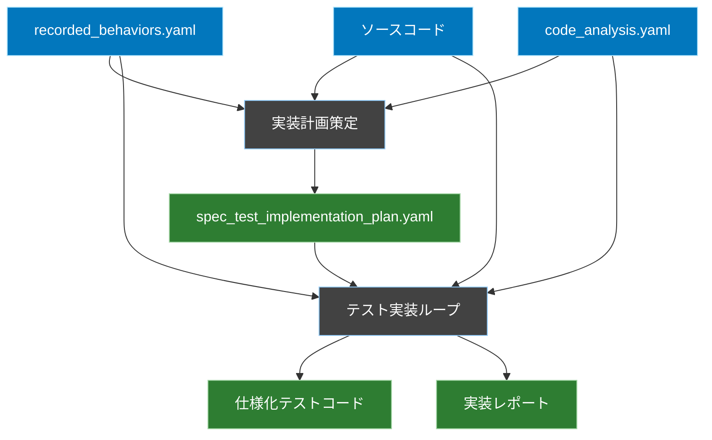
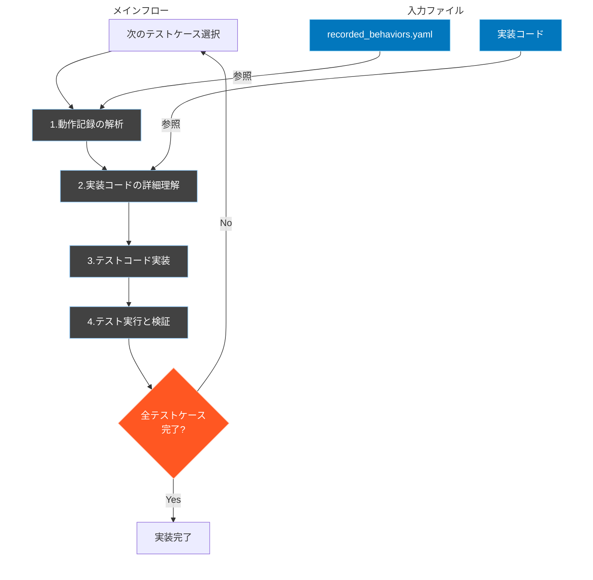

# 仕様化テスト実装ワークフロー

## 概要
recorded_behaviors.yamlに記録された動作を、実際のソースコードを参照しながら正確に再現するテストコードを実装するためのワークフロー定義です。

## ワークフロー全体図


## 1. 実装計画策定フェーズ

### 概要
recorded_behaviors.yamlとcode_analysis.yamlから、テスト実装の計画を策定します。

### 入力
- recorded_behaviors.yaml（動作記録）
- ソースコード
- code_analysis.yaml（実装コードの解析結果）

### 処理内容
1. **実装対象の特定と優先順位付け**
   - recorded_behaviors.yamlから実装対象となる動作を特定
   - 以下の観点で優先順位を評価：
     - テストケースの依存関係
     - データ準備の要件
     - 実装の複雑さ

2. **実装順序の決定**
   - code_analysis.yamlを参照し、実装の技術的な制約を確認
   - テストの実行順序を決定

### 出力
```yaml
# spec_test_implementation_plan.yaml
implementation_plan:
  targets:
    - id: "todo_creation"
      priority: 1
      source_file: "app/Http/Controllers/TodoController.php"
      recorded_behavior: "scenarios.todo_basic_flow"
      required_data:
        - "test_user"
        - "todo_tags"
      implementation_notes: "基本的なTodo作成フローの検証"

    - id: "todo_with_tags"
      priority: 2
      source_file: "app/Http/Controllers/TodoController.php"
      recorded_behavior: "scenarios.todo_with_tags"
      required_data:
        - "test_user"
        - "todo_tags"
      implementation_notes: "タグ付きTodo作成の検証"
```

## 2. テスト実装ループフェーズ

### 概要
実装計画（spec_test_implementation_plan.yaml）に定義された各テストケースを順次実装していきます。
以下のループを、すべてのテストケースが実装完了するまで繰り返します。



### ループの各ステップ詳細

1. **次のテストケース選択**
   - spec_test_implementation_plan.yamlから未実装のテストケースを優先順位に従って選択
   ```yaml
   # 例：次に実装するテストケースの選択
   current_target:
     id: "todo_policy_update"
     priority: 3
     source_file: "app/Policies/TodoPolicy.php"
     required_data:
       - "test_user"
       - "sample_todo"
     dependencies:
       - "todo_service_get_todos"
     implementation_notes: "タスク更新ポリシーの検証"
   ```

2. **動作記録の解析**

   a. **動作記録の特定**
      - recorded_behaviors.yamlから対象テストケースの動作記録を抽出
      - 動作記録の構造を理解
      ```yaml
      # 例：TodoController.updateの動作記録
      TodoController.update:
        test_cases:
          basic:
            description: "基本的なタスク更新の動作を記録"
            execution:
              steps:
                - action: "タスク更新"
                  path: "/todos/3"
                  method: "PUT"
                  input:
                    title: "更新後のタスク"
                    description: "これは更新後のタスクです"
      ```

   b. **テストポイントの抽出**
      - 入力データの特定
      - 期待される出力の特定
      - 状態変化の特定
      - エッジケースの特定

3. **実装コードの詳細理解**

   a. **関連ファイルの特定**
      - 主要な実装ファイル
      - 関連するモデル
      - 依存するサービス
      - ポリシーやバリデーション

   b. **コードの構造解析**
      - メソッドのシグネチャ
      - 処理フロー
      - データの流れ
      - エラーハンドリング
      ```php
      // 例：TodoPolicyの実装
      public function update(User $user, Todo $todo)
      {
          return $user->id === $todo->user_id;
      }
      ```

   c. **テスト要件の整理**
      - 必要なテストデータ
      - テストケースの分類
      - 検証ポイント

4. **テストコード実装**

   a. **テストクラスの構造化**
      - Unit層とFeature層の適切な分離
      - テストデータのセットアップ
      ```php
      class TodoPolicyTest extends TestCase
      {
          use RefreshDatabase;

          private TodoPolicy $policy;
          private User $user;
          private Todo $todo;

          protected function setUp(): void
          {
              parent::setUp();
              // テストの準備
          }
      }
      ```

   b. **テストケースの実装**
      - 動作記録に基づくテストケース
      - エッジケースのテスト
      - バリデーションのテスト
      ```php
      /**
       * @test
       * @group todo_policy_update
       */
      public function update_allows_todo_owner()
      {
          $result = $this->policy->update($this->user, $this->todo);
          $this->assertTrue($result);
      }
      ```

   c. **アサーションの実装**
      - データベースの状態検証
      - レスポンスの検証
      - 副作用の検証
      ```php
      // データベースの検証
      $this->assertDatabaseHas('todos', [
          'id' => $this->todo->id,
          'title' => '更新後のタスク'
      ]);

      // レスポンスの検証
      $response->assertStatus(302);
      $response->assertRedirect('/todos');
      ```

5. **テスト実行と検証**

   a. **テストの実行**
      ```bash
      php artisan test --group todo_policy_update
      ```

   b. **結果の検証**
      - すべてのテストが成功することを確認
      - カバレッジの確認
      - エッジケースの網羅確認

   c. **実装状況の更新**
      ```yaml
      # implementation_status.yaml
      status:
        completed:
          - id: "todo_policy_update"
            test_files:
              - "tests/Unit/Policies/TodoPolicyTest.php"
              - "tests/Feature/Todo/TodoUpdatePolicyTest.php"
            status: "completed"
            completed_at: "2024-02-15 14:30:00"
      ```

### テスト実装のベストプラクティス

1. **動作記録の忠実な再現**
   - recorded_behaviors.yamlの記録を正確に再現
   - テストデータは動作記録に基づいて作成
   - 検証項目は動作記録から漏れなく抽出

2. **テストの階層化**
   - Unit層：個別のコンポーネントのテスト
     - サービスクラスの機能テスト
     - ポリシーの認可ロジックテスト
     - バリデーションルールのテスト

   - Feature層：統合的な機能テスト
     - HTTPリクエスト/レスポンスのテスト
     - データベーストランザクションのテスト
     - 認証/認可の統合テスト

3. **テストデータの管理**
   - Factory/Seederの適切な使用
   - テストケース間のデータ独立性確保
   - 現実的なテストデータの作成

4. **テストの可読性**
   - 明確なテストケース名
   - テストの意図を示すコメント
   - グループタグによる分類
   ```php
   /**
    * @test
    * @group todo_policy_update
    * @description タスクの所有者が更新できることを確認
    */
   ```

5. **エラーケースの網羅**
   - バリデーションエラー
   - 認可エラー
   - 不正なデータ
   - エッジケース

### ループの終了条件
- spec_test_implementation_plan.yamlに定義されたすべてのテストケースが実装完了
- 各テストケースが動作記録と一致することを確認済み

### 出力（ループ完了後）
1. 実装された仕様化テストコード一式
2. 実装完了レポート
```yaml
# test_implementation_report.yaml
implementation_report:
  status: "completed"
  total_test_cases: 3
  implemented_test_cases: 3
  test_files:
    - path: "tests/Feature/TodoCreationTest.php"
      cases: 1
    - path: "tests/Feature/TodoWithTagsTest.php"
      cases: 1
    - path: "tests/Feature/TodoDeletionTest.php"
      cases: 1
  execution_results:
    total_assertions: 15
    passed: 15
    failed: 0
```

## 実装時の重要な注意点

1. **動作記録の忠実な再現**
   - recorded_behaviors.yamlの記録をそのまま再現することを最優先
   - 「より良い実装」への改善は目的としない

2. **実際の依存関係の維持**
   - モックやスタブは使用しない
   - 実際のデータベースや外部サービスとの連携をそのまま使用

3. **テストデータの準備**
   - 記録時と同じ状態を再現できるようにデータを準備
   - シーダーやマイグレーションを適切に活用

4. **コメントとドキュメント**
   - 参照している動作記録を明確に記載
   - テストの意図と前提条件を明記