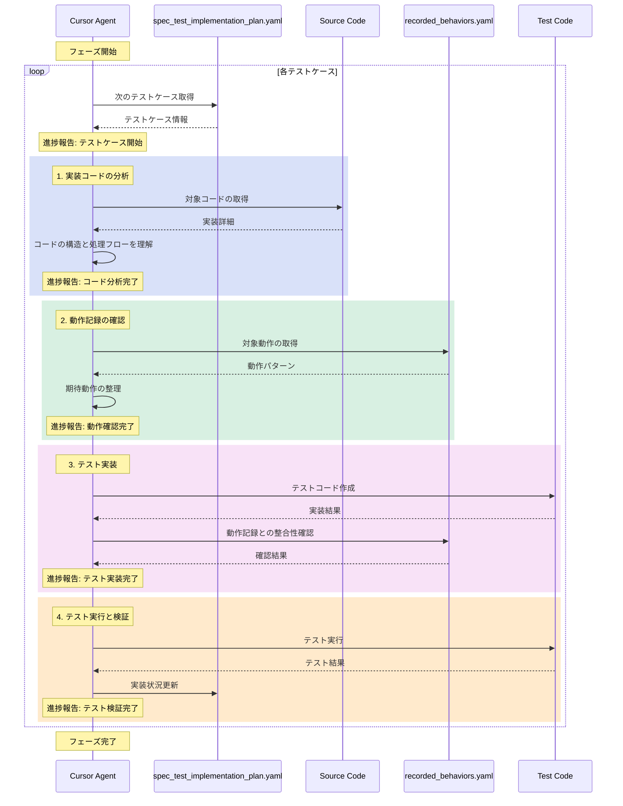

# 仕様化テスト実装ワークフロー

## 概要
recorded_behaviors.yamlに記録された動作を、実際のソースコードを参照しながら正確に再現するテストコードを実装するためのワークフロー定義です。

## 1. 実装計画策定フェーズ

### フェーズの流れ


### 概要
recorded_behaviors.yamlとcode_analysis.yamlから、テスト実装の計画を策定します。

### 入力
- recorded_behaviors.yaml（動作記録）
- ソースコード
- code_analysis.yaml（実装コードの解析結果）


### 1. 動作記録の分析
1. recorded_behaviors.yamlの読み込みと解析
   - 各コントローラーの動作を整理
   - 入力値と期待される結果を抽出
   - データベース変更の記録を確認

2. 動作パターンの分類
   - 正常系と異常系の識別
   - 依存関係の特定
   - 優先順位の決定

### 2. 技術要件の確認
1. code_analysis.yamlの解析
   - 実装の技術的制約を確認
   - 必要なコンポーネントを特定
   - インターフェースの要件を把握

2. セキュリティ要件の確認
   - 認証・認可の要件
   - バージョン管理の仕様
   - データ検証ルール

### 3. 実装計画の策定
1. 出力ファイルの作成
   ```bash
   # 出力先の確認
   target_file="/FLOW/output/output/spec_test_implementation_plan.yaml"
   ```

2. 計画の構造
   ```yaml
   targets:
     - id: string           # 機能ID
       priority: number     # 優先順位
       source_file: string  # 実装対象ファイル
       test_cases:
         - name: string     # テストケース名
           type: string     # テストタイプ
           priority: string # 優先度
           dependencies: [] # 依存関係
           expected_behavior:
             input: {}      # 入力値
             result: {}     # 期待される結果
   ```

3. 検証項目
   - [ ] recorded_behaviors.yamlの全動作が網羅されているか
   - [ ] 依存関係が正しく設定されているか
   - [ ] 優先順位が適切か
   - [ ] セキュリティ要件が満たされているか

### 4. 品質チェック
1. 形式検証
   - YAMLの文法チェック
   - 必須フィールドの存在確認
   - 参照整合性の確認

2. 内容検証
   - recorded_behaviorsとの整合性確認
   - テストケースの網羅性確認
   - 依存関係の循環参照チェック

## 成果物
- /FLOW/output/output/spec_test_implementation_plan.yaml

## 完了条件
1. spec_test_implementation_plan.yamlが正しい場所に生成されていること
2. recorded_behaviors.yamlの全動作が計画に反映されていること
3. 全てのテストケースに具体的な期待動作が記述されていること
4. セキュリティと性能の要件が明示されていること

## エラー処理
1. 出力ディレクトリが存在しない場合
   - ディレクトリを作成
   - 作成できない場合はエラーを報告

2. 整合性エラーの検出時
   - エラー内容を報告
   - 修正案を提示

## 注意事項
- 出力ファイルは必ず指定されたディレクトリに配置すること
- 動作記録との整合性を最優先すること
- セキュリティ要件を明示的に記述すること
- パフォーマンス最適化の方針を含めること

## 2. テスト実装ループフェーズ

### 実装ループの基本構造
各テストケースの実装は、以下のシーケンス図に厳密に従って進行します：



### 進捗報告フォーマット
各ステップ完了時に必ず以下のフォーマットで報告を行います：

```markdown
## 進捗報告
現在のテストケース: [テストケース名]
完了したステップ: [ステップ名]
次のステップ: [次のステップ名]
状態: [正常 or エラー]
```

### エラー発生時の対応フロー
エラーが発生した場合、以下の手順で対応します：

1. **エラー状況の把握**
```markdown
## エラー報告
発生箇所: [ステップ名]
エラー内容: [具体的な内容]
対象テストケース: [テストケース名]
```

2. **動作記録の確認**
```markdown
## 動作記録確認
対象動作ID: [ID]
該当箇所: [具体的な記述]
期待される動作: [動作の詳細]
```

3. **実装コードの確認**
```markdown
## 実装コード確認
対象ファイル: [ファイルパス]
関連メソッド: [メソッド名]
処理内容: [具体的な処理]
```

4. **解決策の実施**
```markdown
## 解決策実施
修正方針: [具体的な方針]
修正内容: [変更点の詳細]
整合性確認:
  - 動作記録との整合性: [確認結果]
  - 実装コードとの整合性: [確認結果]
```

### テストケース実装の詳細手順

1. **実装コードの分析**
   ```markdown
   ## コード分析レポート
   対象コンポーネント: [コンポーネント名]
   主要な処理フロー:
     1. [処理ステップ1]
     2. [処理ステップ2]
     ...
   依存関係:
     - [依存コンポーネント1]
     - [依存コンポーネント2]
   ```

2. **動作記録の確認**
   ```markdown
   ## 動作記録分析
   対象動作: [動作ID]
   入力データ:
     - [入力項目1]: [値]
     - [入力項目2]: [値]
   期待される結果:
     - [結果項目1]: [期待値]
     - [結果項目2]: [期待値]
   ```

3. **テスト実装**
   ```markdown
   ## テスト実装状況
   テストケース名: [名前]
   実装内容:
     1. セットアップ: [詳細]
     2. テスト実行: [詳細]
     3. アサーション: [詳細]
   動作記録との整合性: [確認結果]
   ```

4. **テスト実行と検証**
   ```markdown
   ## テスト実行結果
   実行結果: [成功/失敗]
   検証項目:
     - [項目1]: [結果]
     - [項目2]: [結果]
   更新状況: [実装計画の更新内容]
   ```

### 注意事項

1. **進捗報告の徹底**
   - 各ステップ完了時に必ず進捗報告を行う
   - エラー発生時は即座に報告する
   - 次のステップに進む前に現在のステップの完了を確認する

2. **シーケンス遵守**
   - シーケンス図の順序を厳密に守る
   - ステップのスキップは禁止
   - 必要に応じて前のステップに戻ることは可能

3. **整合性の確保**
   - 動作記録と実装コードの両方を常に参照
   - 矛盾が発生した場合は即座に報告
   - 独自の判断による変更は行わない

### 成果物
- 実装された仕様化テストコード
- test_implementation_report.yaml

### 完了条件
- すべてのテストケースが実装され、動作記録と一致
- すべてのテストが成功
- 実装レポートが生成されている

## 実装時の重要な注意点

1. **動作記録の忠実な再現**
   - recorded_behaviors.yamlの記録をそのまま再現することを最優先
   - 「より良い実装」への改善は目的としない

2. **実際の依存関係の維持**
   - モックやスタブは使用しない
   - 実際のデータベースや外部サービスとの連携をそのまま使用

3. **テストデータの準備**
   - 記録時と同じ状態を再現できるようにデータを準備
   - シーダーやマイグレーションを適切に活用

4. **コメントとドキュメント**
   - 参照している動作記録を明確に記載
   - テストの意図と前提条件を明記