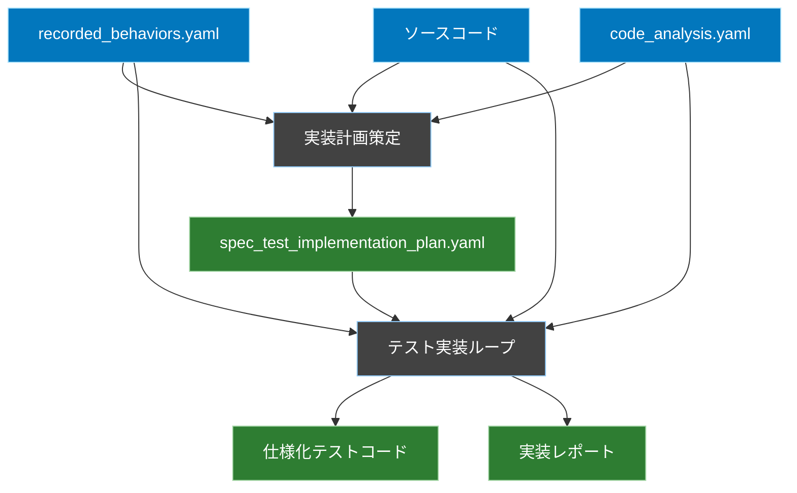
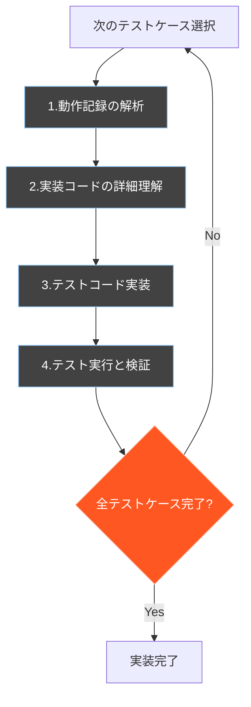

# 仕様化テスト実装ワークフロー

## 概要
recorded_behaviors.yamlに記録された動作を、実際のソースコードを参照しながら正確に再現するテストコードを実装するためのワークフロー定義です。

## ワークフロー全体図


## 1. 実装計画策定フェーズ

### 概要
recorded_behaviors.yamlとcode_analysis.yamlから、テスト実装の計画を策定します。

### 入力
- recorded_behaviors.yaml（動作記録）
- ソースコード
- code_analysis.yaml（実装コードの解析結果）

### 処理内容
1. **実装対象の特定と優先順位付け**
   - recorded_behaviors.yamlから実装対象となる動作を特定
   - 以下の観点で優先順位を評価：
     - テストケースの依存関係
     - データ準備の要件
     - 実装の複雑さ

2. **実装順序の決定**
   - code_analysis.yamlを参照し、実装の技術的な制約を確認
   - テストの実行順序を決定

### 出力
```yaml
# spec_test_implementation_plan.yaml
implementation_plan:
  targets:
    - id: "todo_creation"
      priority: 1
      source_file: "app/Http/Controllers/TodoController.php"
      recorded_behavior: "scenarios.todo_basic_flow"
      required_data:
        - "test_user"
        - "todo_tags"
      implementation_notes: "基本的なTodo作成フローの検証"

    - id: "todo_with_tags"
      priority: 2
      source_file: "app/Http/Controllers/TodoController.php"
      recorded_behavior: "scenarios.todo_with_tags"
      required_data:
        - "test_user"
        - "todo_tags"
      implementation_notes: "タグ付きTodo作成の検証"
```

## 2. テスト実装ループフェーズ

### 概要
実装計画（spec_test_implementation_plan.yaml）に定義された各テストケースを順次実装していきます。
以下のループを、すべてのテストケースが実装完了するまで繰り返します。



### ループの各ステップ

1. **次のテストケース選択**
   - spec_test_implementation_plan.yamlから未実装のテストケースを優先順位に従って選択
   ```yaml
   # 例：次に実装するテストケースの選択
   current_target:
     id: "todo_creation"
     priority: 1
     source_file: "app/Http/Controllers/TodoController.php"
     recorded_behavior: "scenarios.todo_basic_flow"
   ```

2. **動作記録の解析**
   - recorded_behaviors.yamlから対象テストケースの詳細を抽出
   - 入力データ、期待される出力、状態変化を特定

3. **実装コードの詳細理解**
   a. **メソッドの構造解析**
      - シグネチャ（引数、戻り値の型）の確認
      - バリデーションルールの把握
      - 内部で使用される定数や設定値の特定
   
   b. **処理フローの把握**
      - 前処理（認証、認可）の確認
      - 主要な処理ステップの特定
      - データベーストランザクションの範囲
      - エラーハンドリングのパターン
   
   c. **依存関係の確認**
      - 利用している他のクラスやメソッド
      - データベースのテーブル構造とリレーション
      - 外部サービスとの連携ポイント
   
   d. **副作用の特定**
      - データベースの状態変化
      - ファイル操作
      - キャッシュの更新
      - イベント発火
   
   ```php
   // 実装コードの例（解析対象）
   public function store(TodoRequest $request)
   {
       // 認可チェック
       $this->authorize('create', Todo::class);
       
       // トランザクション開始
       DB::beginTransaction();
       try {
           // Todoの作成
           $todo = Todo::create([
               'title' => $request->title,
               'description' => $request->description,
               'user_id' => auth()->id()
           ]);
           
           // タグの関連付け
           if ($request->has('tags')) {
               $todo->tags()->attach($request->tags);
           }
           
           // イベント発火
           event(new TodoCreated($todo));
           
           DB::commit();
           return response()->json($todo, 201);
       } catch (\Exception $e) {
           DB::rollback();
           throw $e;
       }
   }
   ```

4. **テストコード実装**
   ```php
   /**
    * Todo作成機能の仕様化テスト
    * 参照動作記録: recorded_behaviors.yaml > scenarios.todo_basic_flow
    *
    * 実装の注意点:
    * - TodoRequestによるバリデーション
    * - create権限のチェック
    * - トランザクション内での処理
    * - タグ関連付けの有無
    * - TodoCreatedイベントの発火
    */
   class TodoCreationTest extends TestCase
   {
       protected function setUp(): void
       {
           parent::setUp();
           // 記録された初期状態を再現
           $this->seed(TestDataSeeder::class);
           
           // イベントリスナーの準備（副作用の検証用）
           Event::fake([TodoCreated::class]);
       }

       public function test_create_todo_with_basic_flow()
       {
           // 1. 記録された入力データを使用
           $input = [
               'title' => 'テストTodo',
               'description' => 'これはテストです',
               'tags' => [1, 2]  // 記録された関連タグ
           ];

           // 2. 記録された操作を再現
           $response = $this->actingAs($this->testUser)
                          ->post('/api/todos', $input);

           // 3. 記録された結果と一致することを検証
           $response->assertStatus(201);
           
           // データベースの状態変化を検証
           $this->assertDatabaseHas('todos', [
               'title' => 'テストTodo',
               'user_id' => $this->testUser->id
           ]);
           
           // タグの関連付けを検証
           $todo = Todo::latest()->first();
           $this->assertEquals([1, 2], $todo->tags->pluck('id')->toArray());
           
           // イベント発火を検証
           Event::assertDispatched(TodoCreated::class);
       }
   }
   ```

5. **テスト実行と検証**
   - 実装したテストコードを実行
   - 動作記録との一致を確認
   - 実装状況を更新
   ```yaml
   # implementation_status.yaml
   status:
     completed:
       - id: "todo_creation"
         test_file: "tests/Feature/TodoCreationTest.php"
         status: "completed"
     pending:
       - id: "todo_with_tags"
         priority: 2
       - id: "todo_deletion"
         priority: 3
   ```

### ループの終了条件
- spec_test_implementation_plan.yamlに定義されたすべてのテストケースが実装完了
- 各テストケースが動作記録と一致することを確認済み

### 出力（ループ完了後）
1. 実装された仕様化テストコード一式
2. 実装完了レポート
```yaml
# test_implementation_report.yaml
implementation_report:
  status: "completed"
  total_test_cases: 3
  implemented_test_cases: 3
  test_files:
    - path: "tests/Feature/TodoCreationTest.php"
      cases: 1
    - path: "tests/Feature/TodoWithTagsTest.php"
      cases: 1
    - path: "tests/Feature/TodoDeletionTest.php"
      cases: 1
  execution_results:
    total_assertions: 15
    passed: 15
    failed: 0
```

## 実装時の重要な注意点

1. **動作記録の忠実な再現**
   - recorded_behaviors.yamlの記録をそのまま再現することを最優先
   - 「より良い実装」への改善は目的としない

2. **実際の依存関係の維持**
   - モックやスタブは使用しない
   - 実際のデータベースや外部サービスとの連携をそのまま使用

3. **テストデータの準備**
   - 記録時と同じ状態を再現できるようにデータを準備
   - シーダーやマイグレーションを適切に活用

4. **コメントとドキュメント**
   - 参照している動作記録を明確に記載
   - テストの意図と前提条件を明記