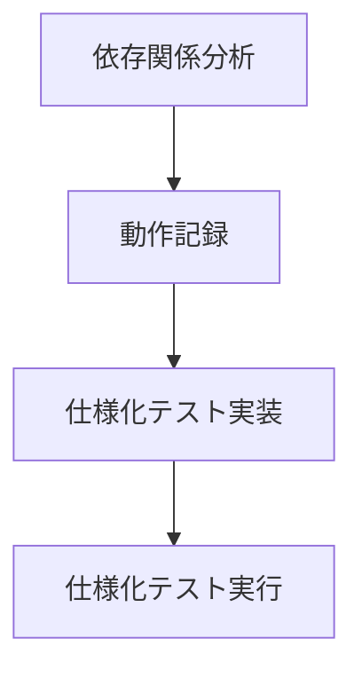
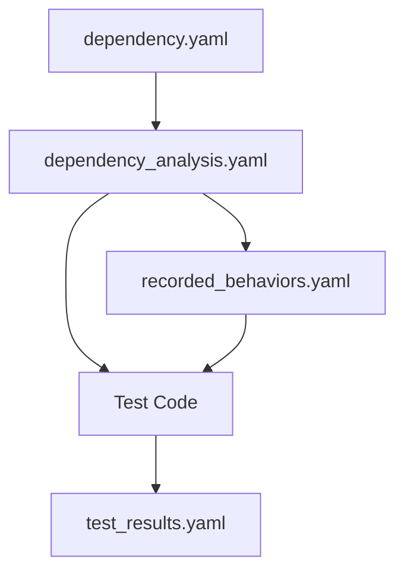

# 仕様化テストフェーズ定義

## フェーズ概要


## 1. 依存関係分析フェーズ
**実行ワークフロー**: `WORKFLOW_SPEC_TEST_DI_ANALYZE.md`

### 目的
- リファクタリング対象コードの依存関係を分析
- テスト戦略決定のための情報収集
- 依存関係の構造化と可視化

### 入力
- 依存関係YAML（`dependency.yaml`）

### 出力
- 依存関係分析結果（`FLOW/output/dependency_analysis.yaml`）

## 2. 動作記録フェーズ
**実行ワークフロー**: `WORKFLOW_SPEC_TEST_RECORFING.md`（観点情報補完から動作記録まで）

### 目的
- 既存コードの動作観察計画の立案
- 動作記録の実施
- 実際の動作の記録

### 入力
- 依存関係分析結果（`FLOW/output/dependency_analysis.yaml`）

### 出力
- 動作記録（`FLOW/output/recorded_behaviors.yaml`）

## 3. 仕様化テスト実装フェーズ
**実行ワークフロー**: `WORKFLOW_SPEC_TEST_IMPL.md`

### 目的
- テスト実装計画の策定
- テストコードの実装
- 実装レポートの生成

### 入力
- 動作記録（`FLOW/output/recorded_behaviors.yaml`）
- 依存関係分析（`FLOW/output/dependency_analysis.yaml`）

### 処理内容
1. テスト実装計画の策定
   - 動作記録の分析と実装範囲の特定
   - テストケースの優先順位付け
   - 必要なモックやスタブの特定
   - テストデータ要件の定義

2. テスト構造の決定
   - 実装計画に基づくテストクラスの配置
   - 優先順位の反映
   - 依存関係分析を参照した実装コンテキストの把握

3. テストケースの実装
   - 動作記録に基づく初期状態の設定
   - 観察された処理フローの再現
   - 状態変化を含む期待動作の検証

4. テストコードの生成
   - 実装が持つ現在の動作の忠実な再現
   - 動作記録との整合性確保
   - 実装コンテキストの保持

### 出力
- テストコード（`tests/Feature/**/*Test.php`）
- 実装レポート（`FLOW/output/test_implementation_report.yaml`）
  - 実装の追跡可能性
  - 動作記録との整合性
  - 実装コンテキストの保持状況
  - 実装の進捗状況

## 4. 仕様化テスト実行フェーズ
**実行ワークフロー**: `WORKFLOW_SPEC_TEST_EXEC.md`

### 目的
- 実装したテストの実行と結果の収集
- 実装レポートとの整合性確認
- カバレッジ情報の収集と分析

### 入力
- テストコード（`tests/Feature/**/*Test.php`）
- 実装レポート（`FLOW/output/test_implementation_report.yaml`）

### 処理内容
1. テストの実行
   - PHPUnitによるテストの実行
   - テスト結果の収集
   - コードカバレッジの計測

2. 実装レポートとの整合性確認
   - テストケースの実行結果と実装計画の照合
   - 実行順序と優先度の確認

3. 結果の集計とレポート生成
   - テスト実行結果の構造化
   - カバレッジ情報の集計

### 出力
- テスト実行結果（`FLOW/output/test_results.yaml`）
- カバレッジレポート（`FLOW/output/coverage_report.html`）
  ```yaml
  evaluation:
    coverage_status: "PASS|FAIL"
    test_quality: "PASS|FAIL"
    improvements_needed: [...]
    next_action: "PROCEED|RETRY"
  ```

## フェーズ間のファイル依存関係


## 注意事項
1. 各フェーズは独立したワークフローファイルで管理
2. フェーズ間の入出力ファイルは厳密に定義
3. 評価フェーズでNGの場合は必要なフェーズに戻る
4. 全フェーズでレビューポイントを設定 