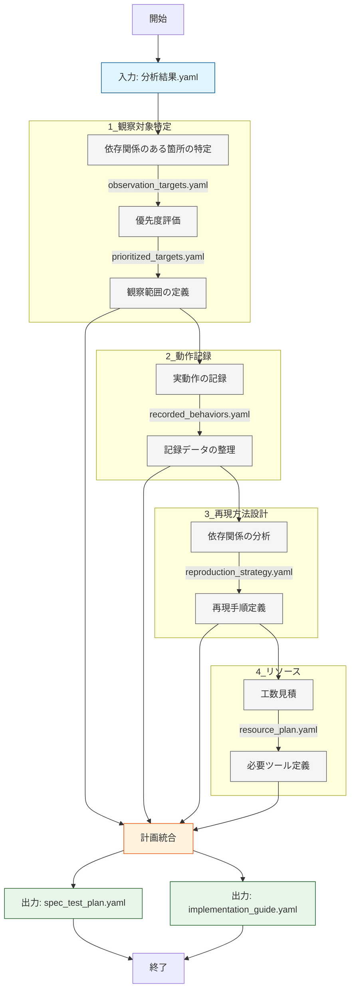

# 仕様化テスト計画ワークフロー

## フェーズ内フロー


## 1. 観察対象特定フェーズ
### 入力
- 分析結果.yaml
```yaml
component_analysis:
  app/Http/Controllers/TodoController.php:
    metrics:
      coupling:
        direct_dependencies: 4
        indirect_dependencies: 7
    characteristics:
      global_state: false
      static_methods: true
    behavior_points:
      - "外部APIからのデータ取得"
      - "データベースへの保存"
```

### 処理内容
1. 依存関係のある箇所の特定
2. 優先度評価
3. 観察範囲の定義

### 出力
- observation_targets.yaml
```yaml
targets:
  - component: "TodoController::store"
    type: "method"
    observation_points:
      - point: "メソッド入口"
        capture: "HTTPリクエストの内容"
      - point: "外部API呼び出し"
        capture: "リクエスト/レスポンスの内容"
      - point: "DB操作"
        capture: "実行されるSQL"
      - point: "メソッド出口"
        capture: "HTTPレスポンスの内容"
```

## 2. 動作記録フェーズ
### 入力
- observation_targets.yaml

### 処理内容
1. 実動作の記録
   - 本番環境での実際の動作を記録
   - 複数回の実行結果を収集
2. 記録データの整理
   - パターン分類
   - 記録データの構造化

### 出力
- recorded_behaviors.yaml
```yaml
recorded_behaviors:
  - component: "TodoController::store"
    timestamp: "2024-03-20 10:00:00"
    input:
      http_method: "POST"
      path: "/todos"
      headers: {}
      body: {
        "title": "買い物",
        "description": "牛乳を買う"
      }
    external_calls:
      - type: "外部API"
        actual_request: {
          "method": "POST",
          "url": "/api/v1/todos",
          "body": {}
        }
        actual_response: {
          "status": 200,
          "body": {}
        }
      - type: "Database"
        actual_query: "INSERT INTO todos (...) VALUES (...)"
        actual_params: []
    output:
      status: 201
      headers: {}
      body: {}
```

## 3. 再現方法設計フェーズ
### 入力
- recorded_behaviors.yaml

### 処理内容
1. 依存関係の分析
   - モック化可能な依存関係の特定
   - モック化が困難な依存関係の特定
2. 再現手順定義
   - 各依存関係に応じた再現方法の検討
   - 実際の依存先を使用する場合の考慮事項

### 出力
- reproduction_strategy.yaml
```yaml
reproduction_strategy:
  - component: "TodoController::store"
    dependencies:
      - target: "外部API"
        characteristics:
          injectable: false
          reason: "静的ファサードを使用"
        reproduction_method: "実際のAPIエンドポイントを使用"
        considerations:
          - "テスト用APIの準備"
          - "テストデータのクリーンアップ"
      
      - target: "Database"
        characteristics:
          injectable: false
          reason: "グローバルDB接続を使用"
        reproduction_method: "テスト用DBを使用"
        considerations:
          - "トランザクション制御"
          - "テストデータの分離"
    
    steps:
      - order: 1
        action: "記録したHTTPリクエストを送信"
      - order: 2
        action: "依存先の状態を記録した状態に整える"
      - order: 3
        action: "実行結果が記録と一致することを確認"
```

## 4. リソース計画フェーズ
### 入力
- recorded_behaviors.yaml

### 処理内容
1. 工数見積
2. 必要ツール定義

### 出力
- resource_plan.yaml
```yaml
resource_allocation:
  estimated_time: "4人日"
  required_tools:
    - "WireMock"
    - "SQLite"
  prerequisites:
    - "外部APIの仕様書"
    - "DBスキーマ定義"
```

## 5. 最終出力生成フェーズ
### 出力
1. spec_test_plan.yaml
```yaml
spec_test_plan:
  implementation_order:
    - sequence: 1
      component: "TodoController::store"
      priority: "high"
      reason: "複数の外部依存を持つ"
  
  recorded_behaviors:
    # recorded_behaviors.yaml の内容をそのまま含める
    
  reproduction_strategy:
    # reproduction_strategy.yaml の内容をそのまま含める
    
  resource_allocation:
    # resource_plan.yaml の内容をそのまま含める
```

2. implementation_guide.yaml
```yaml
implementation_guide:
  setup_instructions:
    - "テスト用の依存先環境のセットアップ"
    - "必要なテストデータの準備"
  
  reproduction_points:
    - category: "外部API連携"
      characteristics:
        injectable: false
      approach:
        - "テスト用APIエンドポイントの使用"
        - "テストデータの事前準備"
    
    - category: "データベース操作"
      characteristics:
        injectable: false
      approach:
        - "テスト用DBの使用"
        - "トランザクションによる分離"
``` 