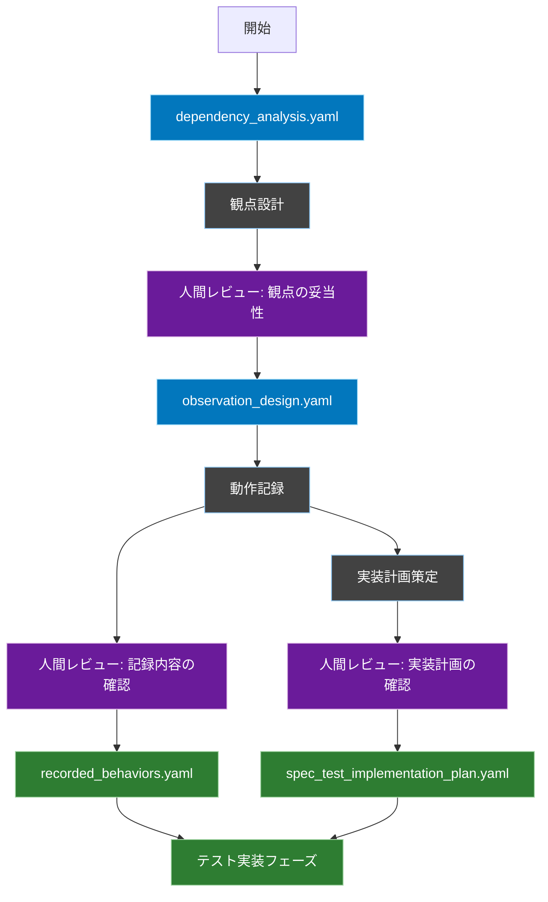
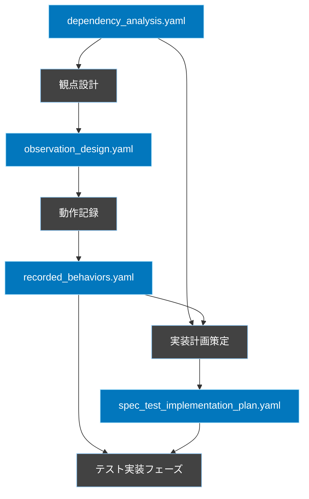

# 仕様化テスト計画ワークフロー

## 概要
このワークフローは、依存性分析の結果を基に、既存の動作を保証するための仕様化テストの計画を立案します。観点を先に設計し、その観点に基づいて実際の動作を記録します。実装フェーズでは、実装計画書による全体方針と、動作記録による具体的なテストケースの両方を活用します。

## ワークフロー全体図


## フェーズ間の依存関係


## 1. 観点設計フェーズ

### 概要
依存性分析の結果から、どのような観点で動作を観察すべきかを設計します。この段階では期待値は設定せず、「何を」「どのような状況で」観察するかを定義します。

### 入力
- `FLOW/output/dependency_analysis.yaml`

### 出力
- `FLOW/temp/observation_design.yaml`

### 出力ファイル形式
```yaml
observation_points:
  - component: "AuthController::login"
    priority: "high"
    reason: "security_score: 0.9"
    aspects:
      - aspect: "認証フロー"
        situations:
          - "正しい認証情報での実行"
          - "誤った認証情報での実行"
          - "無効なトークンでの実行"
        capture_points:
          - "認証前の状態"
          - "認証処理中の各ステップ"
          - "認証後の状態変化"

      - aspect: "セッション管理"
        situations:
          - "新規セッション生成時"
          - "既存セッション更新時"
        capture_points:
          - "セッションデータの変化"
          - "トークンの生成状態"

  - component: "TodoController::store"
    priority: "high"
    reason: "complexity_score: 0.8"
    aspects:
      - aspect: "データ整合性"
        situations:
          - "単純なTodo作成"
          - "タグ付きTodo作成"
          - "無効なタグ指定"
        capture_points:
          - "DBの状態変化"
          - "関連テーブルの整合性"
```

## 2. 動作記録フェーズ

### 概要
設計された観点に基づいて、実際の動作を記録します。Cursorのエージェントモードでサーバを起動し、人間の操作による動作確認と記録を行います。この段階では「こう動くべき」という判断は行わず、純粋に「こう動く」という事実を記録します。

### 手順
1. **環境準備**
   ```bash
   # Cursorエージェントがサーバを起動
   php artisan serve
   ```

2. **操作指示**
   - エージェントは`observation_design.yaml`の各`situations`に基づいて、
     人間に対して具体的な操作手順を指示します
   ```yaml
   # 操作指示例
   instruction:
     situation: "タグ付きTodo作成"
     steps:
       1: "ログインページにアクセス: GET /login"
       2: "テストユーザーでログイン"
       3: "Todo作成ページにアクセス: GET /todos/create"
       4: "フォームに以下の値を入力:"
          - "タイトル: テストTodo"
          - "説明: テスト説明"
          - "タグ: 既存のタグを選択"
       5: "作成ボタンをクリック: POST /todos"
   ```

3. **動作記録**
   - エージェントは指示された操作の実行結果を記録
   - サーバログ、データベースの変更、レスポンス内容を収集
   - 記録された情報は構造化されたYAMLとして保存

### 入力
- `FLOW/temp/observation_design.yaml`

### 出力
- `FLOW/output/recorded_behaviors.yaml`

### 出力ファイル形式
```yaml
recorded_behaviors:
  - component: "TodoController::store"
    aspect: "データ整合性"
    situation: "タグ付きTodo作成"
    observed_flow:
      - step: "リクエスト受付"
        actual_behavior: "POST /api/todos"
        request_data:
          title: "テストTodo"
          description: "テスト説明"
          tags: [1, 2]
        
      - step: "認可確認"
        actual_behavior: "Gate::allows('create-todo')を実行"
        auth_status: "認証済みユーザー"
        
      - step: "データ検証"
        actual_behavior: "title, description, tagsの存在確認"
        validation_rules:
          title: "required|string|max:255"
          description: "required|string"
          tags: "array|exists:tags,id"
        
      - step: "DB操作"
        actual_behavior:
          - "todosテーブルに1レコード追加"
          - "todo_tagテーブルに関連レコード追加"
        db_changes:
          todos:
            - id: 1
              title: "テストTodo"
              description: "テスト説明"
          todo_tag:
            - todo_id: 1
              tag_id: 1
            - todo_id: 1
              tag_id: 2
```

### エージェントの役割
1. **操作シナリオの生成**
   - `observation_design.yaml`から具体的な操作手順を生成
   - 人間が実行可能な形式での指示を提供

2. **動作の記録**
   - サーバログの収集
   - データベースの状態変化の記録
   - リクエスト/レスポンスの詳細な記録

3. **記録のフォーマット化**
   - 収集した情報を構造化されたYAML形式に変換
   - テスト実装時に参照しやすい形式での保存

## 3. 実装計画策定フェーズ

### 概要
テスト実装の全体方針を策定します。テストの優先順位、カバレッジ要件、テストデータの準備方針などを定義します。

### 入力
- `FLOW/output/dependency_analysis.yaml`
- `FLOW/output/recorded_behaviors.yaml`

### 出力
- `FLOW/output/spec_test_implementation_plan.yaml`

### 出力ファイル形式
```yaml
implementation_plan:
  # プロジェクト全体の方針
  project_info:
    name: "Todo Application"
    test_coverage_requirements:
      overall: 85%
      security_critical: 100%
      high_complexity: 90%

  # テストの優先順位
  priorities:
    high:
      - component: "AuthController"
        reason: "security_score: 0.9"
        coverage_required: 100%
      
      - component: "TodoController"
        reason: "complexity_score: 0.8"
        coverage_required: 90%

  # テストデータ準備方針
  data_requirements:
    factories:
      - name: "TodoFactory"
        fields: ["title", "description", "user_id"]
      - name: "TagFactory"
        fields: ["name"]

    seeders:
      - name: "TestDatabaseSeeder"
        contents:
          - "テストユーザーの作成"
          - "基本タグの作成"
```

## テスト実装フェーズへの入力

### 実装計画書の役割
- テストの全体方針の提供
- カバレッジ要件の定義
- テストの優先順位の指定
- テストデータ準備の方針
- テストクラスの構成方針

### 動作記録の役割
- 具体的なテストケースの提供
- 実際の動作フローの詳細
- 検証ポイントの特定
- エラーケースの情報

## レビューポイント定義

### 観点の妥当性（Review1）
- 重要な観察ポイントが漏れていないか
- 観察すべき状況が適切に定義されているか
- キャプチャポイントは十分か

### 記録内容の確認（Review2）
- 設計された観点に基づく記録ができているか
- 実際の動作が客観的に記録されているか
- エラーケースの記録は十分か

### 実装計画の確認（Review3）
- テストの優先順位は適切か
- カバレッジ要件は妥当か
- テストデータの準備方針は十分か

## レビュー実施のガイドライン
1. 各レビューポイントでは「承認」または「差し戻し」を明確に判断
2. 差し戻しの場合は具体的な修正指示を記録
3. レビュー結果は`review_logs.yaml`に記録

```yaml
review_checkpoint:
  timing: "各フェーズ完了後"
  required_roles:
    - テックリード
    - アーキテクト
  output:
    format: yaml
    location: "FLOW/review_logs.yaml"
  decision:
    options:
      - APPROVED
      - REJECTED
    required_fields:
      - reviewer
      - timestamp
      - comments
      - decision
```