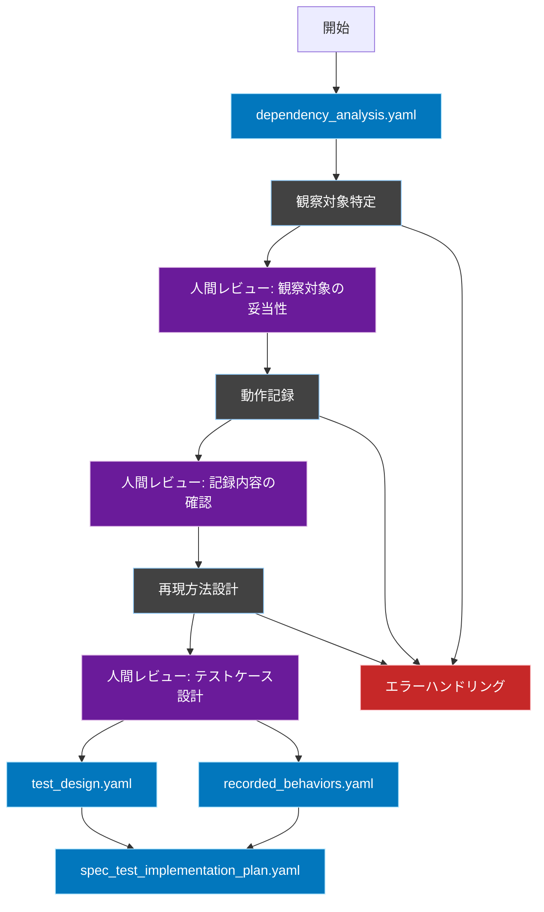
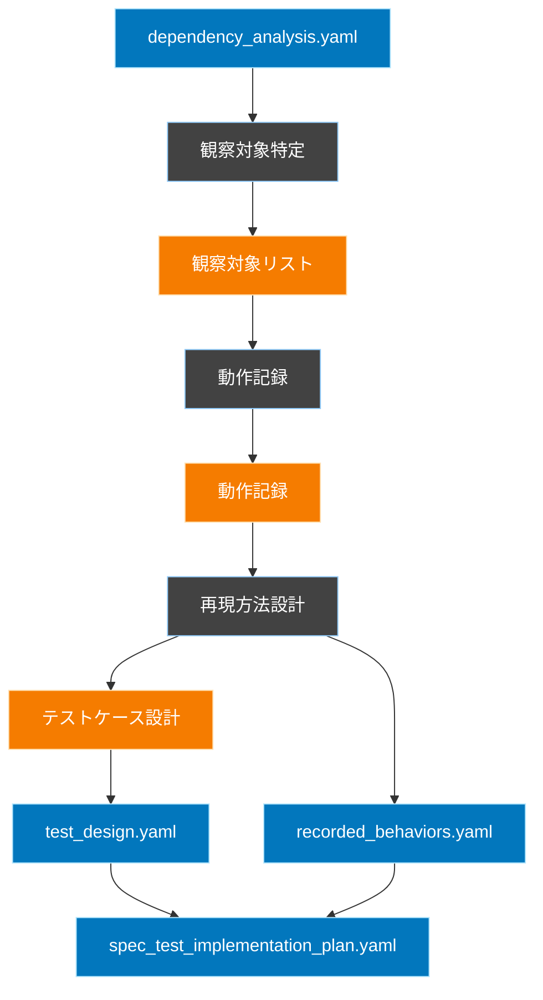

# 仕様化テスト計画ワークフロー

## 概要
このワークフローは、依存性分析の結果を基に、既存の動作を保証するための仕様化テストの計画を立案します。特に、セキュリティクリティカルなコンポーネントや複雑な依存関係を持つ部分に注目し、効果的なテスト計画を作成します。

## ワークフロー全体図


## フェーズ間の依存関係


## 1. 観察対象特定フェーズ

### 概要
依存性分析の結果から、優先的に観察すべき対象を特定します。

### 入力
- `FLOW/output/dependency_analysis.yaml`

### 処理内容
1. セキュリティクリティカルなコンポーネントの特定
2. 複雑な依存関係を持つコンポーネントの特定
3. 循環参照を含むコンポーネントの特定
4. 観察優先度の決定

### 出力
- `FLOW/temp/observation_targets.yaml`
```yaml
targets:
  - component: "AuthController::login"
    priority: "high"
    reason: "security_score: 0.9"
    observation_points:
      - point: "認証処理入口"
        capture: "認証リクエストの内容"
      - point: "認証サービス呼び出し"
        capture: "認証パラメータ"
      - point: "セッション生成"
        capture: "セッション状態"

  - component: "TodoController::store"
    priority: "high"
    reason: "complexity_score: 0.8, circular_dependency"
    observation_points:
      - point: "Todo-Tag相互作用"
        capture: "関連付け状態の変化"
```

## 2. 動作記録フェーズ

### 概要
observation_targets.yamlから観察対象の情報を読み取り、curlコマンドを生成・実行して、実際の動作をTelescopeで記録します。

### 入力
- `FLOW/temp/observation_targets.yaml`

### 出力
- `FLOW/temp/recorded_behaviors.yaml`：構造化された動作記録

### エージェントの実行手順

1. **環境準備**
```bash
# Telescopeの記録をクリア
php artisan telescope:clear

# 開発サーバーが起動していることを確認
curl http://localhost:8000/health
# エラーハンドリング：サーバー起動確認
if [ $? -ne 0 ]; then
    echo "開発サーバーが起動していません"
    exit 1
fi
```

2. **観察対象ごとの実行**
```bash
# 認証が必要な場合はログイン
TOKEN=$(curl -X POST http://localhost:8000/api/login \
     -H "Content-Type: application/json" \
     -d '{"email": "test@example.com", "password": "password123"}' \
     | jq -r '.token')

# エラーハンドリング：認証
if [ $? -ne 0 ]; then
    echo "認証に失敗しました"
    exit 1
fi

# TodoController::storeの実行例
response=$(curl -w "\n%{http_code}" -X POST http://localhost:8000/api/todos \
     -H "Content-Type: application/json" \
     -H "Authorization: Bearer ${TOKEN}" \
     -d '{"title": "買い物", "description": "牛乳を買う", "tags": [1]}')

status=$(echo "$response" | tail -n1)
body=$(echo "$response" | sed '$d')

# エラーハンドリング：APIレスポンス
case $status in
    401)
        echo "認証エラー：トークンが無効です"
        exit 1
        ;;
    422)
        echo "バリデーションエラー：$body"
        # バリデーションエラーは記録対象なので終了しない
        ;;
    500)
        echo "サーバーエラー：$body"
        exit 1
        ;;
esac

# 記録の保存（Telescopeから自動的に記録される）
```

3. **記録の構造化（Telescopeから取得）**
```bash
# 直近の記録を取得
php artisan telescope:export --latest > FLOW/temp/telescope_raw.json
```

4. **動作記録の構造化**
エージェントは`telescope_raw.json`を解析し、以下の手順で`recorded_behaviors.yaml`を生成します：

1. 重要な振る舞いの抽出
   - リクエスト/レスポンスの流れから基本フローを特定
   - SQLクエリから重要なデータ操作を特定
   - イベントから副作用や状態変化を特定

2. 依存関係の分析
   - 認証要件の確認
   - 必要なデータの事前条件を特定
   - 外部サービスへの依存を確認

3. エラーパターンの収集
   - バリデーションエラーの条件
   - 認証/認可エラーの条件
   - その他のビジネスルールによるエラー

### 出力形式
```yaml
# FLOW/temp/recorded_behaviors.yaml
recorded_behaviors:
  - component: "TodoController::store"
    purpose: "Todo新規作成（タグ付き）の基本フロー"
    key_behaviors:
      - step: "認可チェック"
        observed:
          - "ユーザーのTodo作成権限を確認"
          - "リクエストユーザーとトークンの整合性確認"
      
      - step: "入力値バリデーション"
        observed:
          - "titleは必須で255文字以内"
          - "descriptionは1000文字以内"
          - "tagsは存在するtagのidのみ許可"
      
      - step: "Todo作成"
        observed:
          - "ユーザーIDと紐付けて保存"
          - "作成日時は自動設定"
      
      - step: "タグ関連付け"
        observed:
          - "指定されたタグを関連付け"
          - "中間テーブルにレコード作成"
      
      - step: "レスポンス生成"
        observed:
          - "作成されたTodoの情報を返却"
          - "関連付けられたタグ情報も含める"

    dependencies:
      - type: "認証"
        required: true
        details: "有効なBearerトークンが必要"
      
      - type: "データ"
        required: true
        details: "関連付け対象のタグが存在している必要あり"

    error_patterns:
      - condition: "未認証"
        observed: "401 Unauthorizedを返却"
      
      - condition: "バリデーションエラー"
        observed: "422 Unprocessable Entityで詳細を返却"
      
      - condition: "存在しないタグID指定"
        observed: "422 Unprocessable Entityでタグの存在チェックエラーを返却"

meta:
  recorded_at: "2024-03-20 10:00:00"
  environment: "local"
```

### 人間の役割
1. 記録された動作の妥当性確認
   - 期待通りのフローが実行されているか
   - 重要な処理が漏れていないか
   - エラーケースの確認

2. 必要に応じて追加の観察ポイントを提案
   - 見落としている動作がないか
   - 追加で確認すべきエラーケースはないか

## 3. 再現方法設計フェーズ

### 概要
記録された動作を再現可能なテストケースとして設計します。既存の動作を保証するための仕様化テストが目的です。

### 入力
- `FLOW/temp/recorded_behaviors.yaml`：記録された動作
- `FLOW/output/dependency_analysis.yaml`：依存関係の参照用（テストの前提条件の把握）

### エージェントの実行手順

1. **記録された動作の分析**
- key_behaviorsから検証すべき動作を特定
- 各ステップの入力と期待される結果を整理
- error_patternsから異常系の検証ポイントを特定

2. **テストケースの設計**
```yaml
# FLOW/temp/test_design.yaml
test_cases:
  TodoController::store:
    # 正常系：基本フロー
    basic_flow:
      title: "Todo作成の基本フロー"
      context: "認証済みユーザーが有効なデータでTodoを作成"
      steps:
        - description: "Todoを作成"
          input:
            title: "買い物"
            description: "牛乳を買う"
            tags: [1]
          expected:
            status: 201
            data:
              - "作成されたTodoが返却される"
              - "指定したタグが関連付けられている"
            database:
              - "todosテーブルにレコードが作成される"
              - "todo_tagsテーブルに関連が作成される"

    # 異常系：記録されたエラーパターン
    error_cases:
      - title: "バリデーションエラー"
        context: "必須項目が未入力"
        steps:
          - description: "タイトルなしでTodoを作成"
            input:
              description: "牛乳を買う"
            expected:
              status: 422
              errors:
                - "titleは必須項目です"

      - title: "存在しないタグ指定"
        context: "存在しないタグIDを指定"
        steps:
          - description: "無効なタグIDでTodo作成"
            input:
              title: "買い物"
              tags: [999]
            expected:
              status: 422
              errors:
                - "指定されたタグは存在しません"

    # 検証すべき仕様のまとめ
    specifications:
      - "認証済みユーザーのみTodoを作成できる"
      - "タイトルは必須で255文字以内"
      - "タグは存在するものだけ指定可能"
      - "作成したTodoは即座にDBに保存される"
```

### 出力
- `FLOW/temp/test_design.yaml`：テストケース設計書

### 人間の役割
1. テストケース設計の妥当性確認
   - 記録された動作が正しくテストケースに変換されているか
   - 重要な検証ポイントが漏れていないか
   - 異常系の網羅性は十分か

2. 追加のテストケース提案
   - 記録からは読み取れない重要なエッジケース
   - ビジネス上重要な検証ポイント

## 4. 最終出力生成フェーズ

### 概要
仕様化テスト実装ワークフローで使用するために、これまでの分析結果を統合します。

### 入力
- `FLOW/temp/test_design.yaml`：テストケース設計
- `FLOW/temp/recorded_behaviors.yaml`：記録された動作
- `FLOW/output/dependency_analysis.yaml`：依存関係情報

### エージェントの実行手順
1. **テスト実装に必要な情報の統合**
```yaml
# FLOW/output/spec_test_implementation_plan.yaml
implementation_plan:
  # テスト対象コンポーネント情報
  target:
    component: "TodoController::store"
    file_path: "app/Http/Controllers/TodoController.php"
    method: "store"
    
  # テストの前提条件
  prerequisites:
    database:
      - model: "User"
        state: "認証済みユーザー"
      - model: "Tag"
        state: "既存のタグ"
    
  # テストケース定義
  test_cases:
    # test_design.yamlから変換
    basic_flow:
      title: "Todo作成の基本フロー"
      context: "認証済みユーザーが有効なデータでTodoを作成"
      steps: [...]
    error_cases: [...]
    
  # 検証すべき仕様
  specifications:
    - "認証済みユーザーのみTodoを作成できる"
    - "タイトルは必須で255文字以内"
    [...]
    
  # 実際の動作記録（参照用）
  recorded_behavior:
    key_behaviors:
      - step: "認可チェック"
        observed: [...]
    error_patterns: [...]
```

### 出力
- `FLOW/output/spec_test_implementation_plan.yaml`：仕様化テスト実装計画

### 人間の役割
1. 実装計画の妥当性確認
   - テストケースが実装可能な形式になっているか
   - 必要な情報が漏れなく含まれているか

## レビューポイント定義

### 観察対象の妥当性（Review1）
- 依存性分析の結果が適切に反映されているか
- セキュリティクリティカルな部分が漏れなく含まれているか
- 複雑な依存関係を持つ部分が適切に特定されているか

### 記録内容の確認（Review2）
- 重要な動作が漏れなく記録されているか
- 依存関係の相互作用が適切に記録されているか
- セキュリティ関連の動作が詳細に記録されているか

### 再現方法の実現性（Review3）
- 提案された再現方法は実現可能か
- 依存関係の分離戦略は適切か
- テスト環境の制約は考慮されているか

### リソース見積もり（Review4）
- 工数見積もりは現実的か
- 必要なツールや環境は適切か
- 優先順位付けは依存性分析の結果と整合しているか

### 最終計画確認（Review5）
- 全体的な整合性は取れているか
- 実装可能な形式になっているか
- 依存性分析の結果が適切に活用されているか 

## レビュー実施のガイドライン
1. 各レビューポイントでは「承認」または「差し戻し」を明確に判断
2. 差し戻しの場合は具体的な修正指示を記録
3. レビュー結果は`review_logs.yaml`に記録

```yaml
review_checkpoint:
  timing: "各フェーズ完了後"
  required_roles:
    - テックリード
    - アーキテクト
  output:
    format: yaml
    location: "FLOW/review_logs.yaml"
  decision:
    options:
      - APPROVED
      - REJECTED
    required_fields:
      - reviewer
      - timestamp
      - comments
      - decision
```