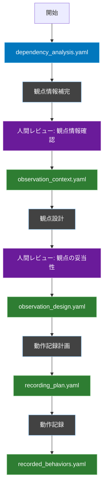
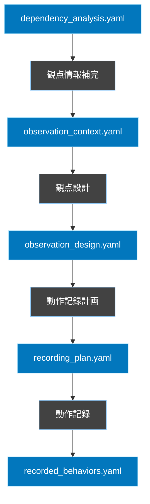

# 仕様化テスト計画ワークフロー

## 概要
このワークフローは、依存性分析の結果を基に、既存システムの動作を正確に記録するためのプロセスを定義します。観点情報の補完から始まり、観点設計、動作記録計画の策定を経て、実際の動作を客観的に記録します。記録された動作は、後続のテスト実装フェーズで具体的なテストケースの基礎として活用されます。

## ワークフロー全体図


## フェーズ間の依存関係


## 1. 観点情報補完フェーズ

### 概要
依存性分析の結果から、観点設計に必要な具体的な情報を補完します。

### 入力
- `FLOW/output/dependency_analysis.yaml`

### 処理内容
1. 依存チェーンからキャプチャポイントを抽出
   - 各コンポーネント・メソッドの処理フローを分析
   - 状態変化が発生するタイミングを特定
   - 記録すべき項目を定義

2. 構造情報から業務フローを詳細化
   - コンポーネントの役割に基づくアクションの特定
   - 具体的な処理ステップの定義
   - 処理の前提条件と期待される結果の明確化

3. 影響分析からエラーケースを特定
   - リスク領域ごとの異常系シナリオの抽出
   - エラー発生時の期待動作の定義
   - テスト項目としての具体化

4. フィードバック収集の仕組み構築
   - 更新トリガーの定義
   - 収集対象情報の特定
   - 反映ルールの設定

### 出力
- `FLOW/temp/observation_context.yaml`

### 出力ファイル形式
```yaml
observation_context:
  # キャプチャポイントの定義
  capture_points:
    - component: "TodoService"
      method: "store"
      points:
        - timing: "処理開始時"
          capture_items: ["入力値", "認証情報"]
        - timing: "永続化前"
          capture_items: ["生成されたエンティティ", "関連エンティティの状態"]
        - timing: "永続化後"
          capture_items: ["保存結果", "イベント発行状態"]

  # 業務フローの詳細
  business_flows:
    - name: "Todo作成フロー"
      steps:
        - component: "TodoController"
          action: "入力値チェック"
          details: ["必須項目確認", "型チェック"]
        - component: "TodoService"
          action: "データ作成リクエスト"
          details: ["エンティティ生成", "関連データ設定"]
        - component: "TodoRepository"
          action: "永続化処理"
          details: ["トランザクション開始", "レコード作成"]

  # エラーケースの定義
  error_scenarios:
    - risk_area: "データ整合性"
      cases:
        - scenario: "タイトル重複"
          expected_behavior: "一意性制約違反エラー"
        - scenario: "無効な関連ID"
          expected_behavior: "外部キー制約違反エラー"
    - risk_area: "APIレスポンス"
      cases:
        - scenario: "無効な入力値"
          expected_behavior: "バリデーションエラー"
        - scenario: "権限不足"
          expected_behavior: "認可エラー"

  # フィードバック収集設定
  feedback_collection:
    timing: ["テスト実行後", "レビュー時"]
    targets: ["キャプチャポイント", "業務フロー", "エラーケース"]
    update_triggers: ["テスト失敗", "レビューコメント"]
```

## 2. 観点設計フェーズ

### 概要
観点情報補完フェーズで得られた情報を基に、具体的な観点を設計します。この段階では期待値は設定せず、「何を」「どのような状況で」観察するかを定義します。

### 入力
- `FLOW/temp/observation_context.yaml`

### 処理内容
1. キャプチャポイントの具体化
   - observation_contextのcapture_pointsを基に観察タイミングを特定
   - 各タイミングでの記録項目を具体的なデータ構造として定義
   - ログレベルやデバッグ情報の出力形式を決定

2. 業務フローの観点定義
   - observation_contextのbusiness_flowsを基に観察シナリオを作成
   - 各ステップでの入出力データの記録方式を定義
   - コンポーネント間の連携状態の観察方法を設計

3. エラーケースの観点定義
   - observation_contextのerror_scenariosを基にエラー観察シナリオを作成
   - 例外発生時の状態記録方式を定義
   - エラー伝播の追跡方法を設計

4. 観察環境の設定定義
   - 各観点での環境要件（DB状態、認証情報等）を定義
   - 観察に必要なログ設定やデバッグモードを指定
   - 外部システムのモック化要件を定義

### 出力
- `FLOW/temp/observation_design.yaml`

### 出力ファイル形式
```yaml
observation_design:
  # キャプチャポイントの具体的な観察方法
  capture_methods:
    - point_id: "TodoService.store.start"
      source: "observation_context.capture_points[0]"
      observation_timing: "メソッド開始直後"
      data_structure:
        input_params:
          type: "array"
          capture_method: "function_args"
        auth_context:
          type: "object"
          capture_method: "auth_facade.getCurrentUser()"

  # 業務フローの観察シナリオ
  flow_scenarios:
    - flow_id: "todo_creation"
      source: "observation_context.business_flows[0]"
      observation_points:
        - step: "入力値チェック"
          timing: "バリデーション実行後"
          capture_data:
            - validation_rules
            - validation_results
        - step: "データ作成"
          timing: "エンティティ生成後"
          capture_data:
            - entity_state
            - related_entities

  # エラーケースの観察シナリオ
  error_scenarios:
    - scenario_id: "duplicate_title"
      source: "observation_context.error_scenarios[0]"
      observation_points:
        - timing: "例外発生時"
          capture_data:
            - exception_type
            - error_message
            - stack_trace
        - timing: "ロールバック後"
          capture_data:
            - transaction_state
            - db_state

  # 観察環境設定
  environment_config:
    logging:
      level: "debug"
      targets: ["file", "console"]
    database:
      transaction_logging: true
      query_logging: true
    auth:
      mock_user_roles: ["user", "admin"]
```

## 3. 動作記録計画フェーズ

### 概要
観点設計と依存関係分析の結果に基づいて、動作記録の実行計画を策定します。テストの実行順序、必要なテストデータ、環境設定などを具体的に定義します。

### 入力
- `FLOW/temp/observation_design.yaml`
- `FLOW/output/dependency_analysis.yaml`

### 処理内容
1. 観察シナリオの構造化
   - observation_designからflow_scenariosとerror_scenariosを抽出
   - 各シナリオのcapture_pointsを構造化
     - メソッドごとのキャプチャタイミングを特定
     - 必要なdata_pointsを定義
   - dependency_analysisから依存コンポーネント情報を付加
     - component_infoの構築
     - dependent_statesの設定

2. 実行順序の決定
   - dependency_analysisのdependency_graphを解析
     - トポロジカルソートによるコンポーネント順序の決定
     - 各コンポーネントのdependency_levelを算出
   - execution_sequenceの構築
     - グループの階層構造を定義
     - 必要なコンポーネント状態を特定

3. 環境設定の構造化
   - observation_designのenvironment_configを基本設定として継承
   - dependency_analysisに基づくコンポーネント固有の設定を追加
     - 依存関係に基づくモック設定の決定
     - シナリオ条件に応じたモック切り替えの定義


### 出力
- `FLOW/temp/recording_plan.yaml`

### 出力ファイル形式
```yaml
recording_plan:
  # 観点設計で定義された観察シナリオの実行計画
  observation_scenarios:
    # 正常系フローの観察計画
    flow_scenarios:
      - id: "todo_creation_flow"
        source: "observation_design.flow_scenarios[0]"
        component_info:
          name: "TodoService"
          dependencies: "${dependency_analysis.components.TodoService.dependencies}"
        capture_points:
          - timing: "メソッド開始直後"
            method: "observation_design.capture_methods.TodoService.store.start"
            data_points: ["input_params", "auth_context"]
            dependent_states:
              - component: "${dependency_analysis.components.TodoService.dependencies[0]}"
                required_state: "authenticated"
          - timing: "バリデーション実行後"
            method: "observation_design.capture_methods.TodoService.store.validation"
            data_points: ["validation_rules", "validation_results"]
    
    # エラーケースの観察計画
    error_scenarios:
      - id: "todo_validation_error"
        source: "observation_design.error_scenarios[0]"
        component_info:
          name: "TodoService"
          dependencies: "${dependency_analysis.components.TodoService.dependencies}"
        capture_points:
          - timing: "例外発生時"
            method: "observation_design.capture_methods.TodoService.store.error"
            data_points: ["exception_type", "error_message"]
            dependent_states:
              - component: "${dependency_analysis.components.TodoService.dependencies[0]}"
                required_state: "unauthenticated"

  # 実行順序の定義（依存関係グラフに基づく）
  execution_sequence:
    # dependency_analysisのコンポーネント依存関係グラフからトポロジカルソート
    order_source: "${dependency_analysis.dependency_graph}"
    groups:
      - group:
          name: "認証基盤"
          component: "${dependency_analysis.components.AuthService}"
          dependency_level: 0  # 最も依存されているコンポーネント
          scenarios: ["auth_flow", "auth_error"]
      - group:
          name: "Todo管理"
          component: "${dependency_analysis.components.TodoService}"
          dependency_level: 1  # AuthServiceに依存
          scenarios: ["todo_creation_flow", "todo_validation_error"]
          required_components:
            - name: "${dependency_analysis.components.AuthService}"
              state: "ready"

  # 観察環境の設定計画
  environment_config:
    source: "observation_design.environment_config"
    component_specific:
      # 依存関係に基づく各コンポーネントの環境設定
      AuthService:
        dependencies: []
        mocks: []
      TodoService:
        dependencies: ["${dependency_analysis.components.TodoService.dependencies}"]
        mocks:
          - component: "AuthService"
            methods: ["getCurrentUser"]
            when: "error_scenarios"
```

## 4. 動作記録フェーズ

### 概要
recording_plan.yamlに基づいて、実際の動作を記録します。Cursorのエージェントは環境を準備し、observation_scenariosに定義された各シナリオについて、人間に操作手順を指示します。各capture_pointsで指定された情報を自動的に収集し、実際の動作を記録します。この段階では「こう動くべき」という判断は行わず、純粋に「こう動く」という事実を記録します。

### 入力
- `FLOW/temp/recording_plan.yaml`

### 処理内容
1. **環境準備**
   ```bash
   # Cursorエージェントがサーバを起動
   php artisan serve
   ```

2. **操作指示**
   - エージェントは`recording_plan.yaml`のexecution_sequenceに従い、各グループを順次実行できるように
     人間に対して具体的な操作手順を指示します
   ```yaml
     # グループごとの操作指示例
     group: "認証基盤"
     scenarios:
       - auth_flow:
           1: "ログインページにアクセス"
           2: "認証情報を入力"
           3: "ログインボタンをクリック"
       - auth_error:
           1: "無効な認証情報でログイン試行"
     ```
  - エージェントは各シナリオのcapture_pointsで指定された情報を収集
     - リクエスト/レスポンスの記録
     - データベースの状態変化の記録
     - ログ情報の収集   

3. **動作記録**
   - エージェントは収集した情報をrecorded_behaviors.yamlの形式に変換
   - 各シナリオの実行結果を整理
   - 記録された情報は構造化されたYAMLとして保存

4. クリーンアップ
   - エージェントはrecording_planのcleanup設定に従って環境をクリーンアップ
   - 一時ファイルの削除
   - データベースのリセット   

### 出力
- `FLOW/output/recorded_behaviors.yaml`

### 出力ファイル形式
```yaml
recorded_behaviors:
  metadata:
    recording_date: "YYYY-MM-DD"
    recording_plan: "recording_plan.yaml#version"
    environment: "development"

  # 実行順序に基づく記録
  execution_groups:
    - group: "認証基盤"
      scenarios:
        - scenario: "auth_flow"
          flows:
            - capture_point: "AuthService.authenticate"
              context:
                timing: "メソッド開始直後"
                environment_state:
                  database: "clean"
                  mocks: []
              captured_data:
                input:
                  username: "sample_user"
                  password: "[masked]"
                auth_state: "未認証"
              
            - capture_point: "AuthService.authenticate"
              context:
                timing: "認証処理後"
              captured_data:
                auth_result: "成功"
                user_session: "生成済"
                
    - group: "Todo管理"
      scenarios:
        - scenario: "todo_creation_flow"
          flows:
            - capture_point: "TodoService.store.start"
              context:
                timing: "メソッド開始直後"
                environment_state:
                  database: "clean"
                  auth: "authenticated"
              captured_data:
                input_params:
                  title: "サンプルTodo"
                  description: "詳細説明"
                auth_context:
                  user_id: 1
                  roles: ["user"]

            - capture_point: "TodoService.store.validation"
              context:
                timing: "バリデーション実行後"
              captured_data:
                validation_rules:
                  title: "required|max:255"
                validation_results:
                  status: "valid"

  # エラーケースの記録
  error_cases:
    - scenario: "todo_validation_error"
      flows:
        - capture_point: "TodoService.store.validation"
          context:
            timing: "バリデーション実行後"
            environment_state:
              database: "clean"
              auth: "authenticated"
          captured_data:
            validation_rules:
              title: "required|max:255"
            validation_results:
              status: "invalid"
              errors:
                title: ["The title field is required."]

  # 観察された制約や特記事項
  observations:
    - type: "business_rule"
      description: "タイトルの重複チェックは大文字小文字を区別する"
    - type: "performance"
      description: "バリデーション処理は常に100ms以内に完了"
```

**動作記録の構成要素**:
- `execution_groups`: 正常系の動作記録
  - `group`: 依存関係に基づく実行グループ
  - `scenarios`: グループ内の実行シナリオ群
  - `flows`: 実行フローの記録
    - `capture_point`: 記録ポイント（メソッド・処理単位）
    - `context`: 実行時のコンテキスト（タイミング・環境状態）
    - `captured_data`: 記録されたデータ（入力・状態・結果）

- `error_cases`: 異常系の動作記録
  - `scenario`: エラーシナリオの識別子
  - `flows`: エラー発生時の処理フロー
    - `capture_point`: エラー発生ポイント
    - `context`: エラー発生時のコンテキスト
    - `captured_data`: エラー時の状態データ

- `observations`: システム全体の特性
  - `type`: 観察事項の種類（制約・相互作用・性能など）
  - `description`: 観察内容の詳細説明

## テスト実装フェーズへの入力

### 実装計画書の役割
- テストの全体方針の提供
- カバレッジ要件の定義
- テストの優先順位の指定
- テストデータ準備の方針
- テストクラスの構成方針

### 動作記録の役割
- 具体的なテストケースの提供
- 実際の動作フローの詳細
- 検証ポイントの特定
- エラーケースの情報

## レビューポイント定義

### 観点情報補完の確認（Review1）
- 依存性分析結果からの情報抽出が適切か
  - キャプチャポイントの網羅性
  - 業務フローの具体性
  - エラーケースの充足性
- フィードバック収集の仕組みは実効性があるか
  - 更新トリガーの適切性
  - 収集情報の十分性
  - 反映ルールの明確性

### 観点設計の妥当性（Review2）
- 観察シナリオの構造
  - キャプチャポイントの配置
  - データ構造の定義
  - タイミングの適切性
- 環境要件の充足性
  - ログ設定の十分性
  - モック化要件の妥当性
  - 外部システム連携の考慮

### 動作記録計画の確認（Review3）
- 実行計画の妥当性
  - シナリオの構造化が適切か
  - 実行順序が依存関係を考慮しているか
  - 環境設定が十分か
- テスト実行可能性
  - 各シナリオの実行手順が明確か
  - 必要なテストデータが定義されているか
- 記録方式の適切性
  - キャプチャポイントの配置が適切か
  - 収集するデータ項目が十分か
  - データ形式が扱いやすいか

### 動作記録の確認（Review4）
- 動作記録の客観性
  - 事実に基づく記録
  - 主観的解釈の排除
  - 再現可能性の確保
- データの構造化
  - 記録フォーマットの一貫性
  - 必要情報の充足
  - トレーサビリティの確保
- エラーケースの充実度
  - 異常系シナリオの網羅性
  - エラー状態の詳細度
  - 回復処理の記録

## レビュー実施のガイドライン
1. 各レビューポイントでは「承認」または「差し戻し」を明確に判断
2. 差し戻しの場合は具体的な修正指示を記録
3. レビュー結果は`review_logs.yaml`に記録

```yaml
review_checkpoint:
  timing: "各フェーズ完了後"
  required_roles:
    - テックリード
    - アーキテクト
  output:
    format: yaml
    location: "FLOW/review_logs.yaml"
  decision:
    options:
      - APPROVED
      - REJECTED
    required_fields:
      - reviewer
      - timestamp
      - comments
      - decision
```