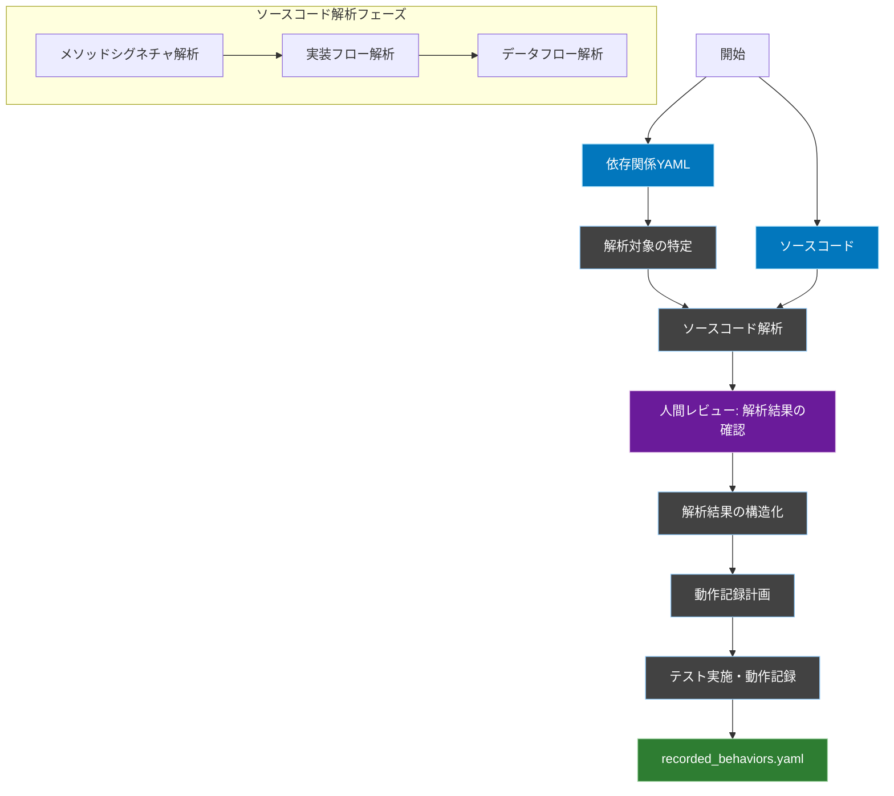
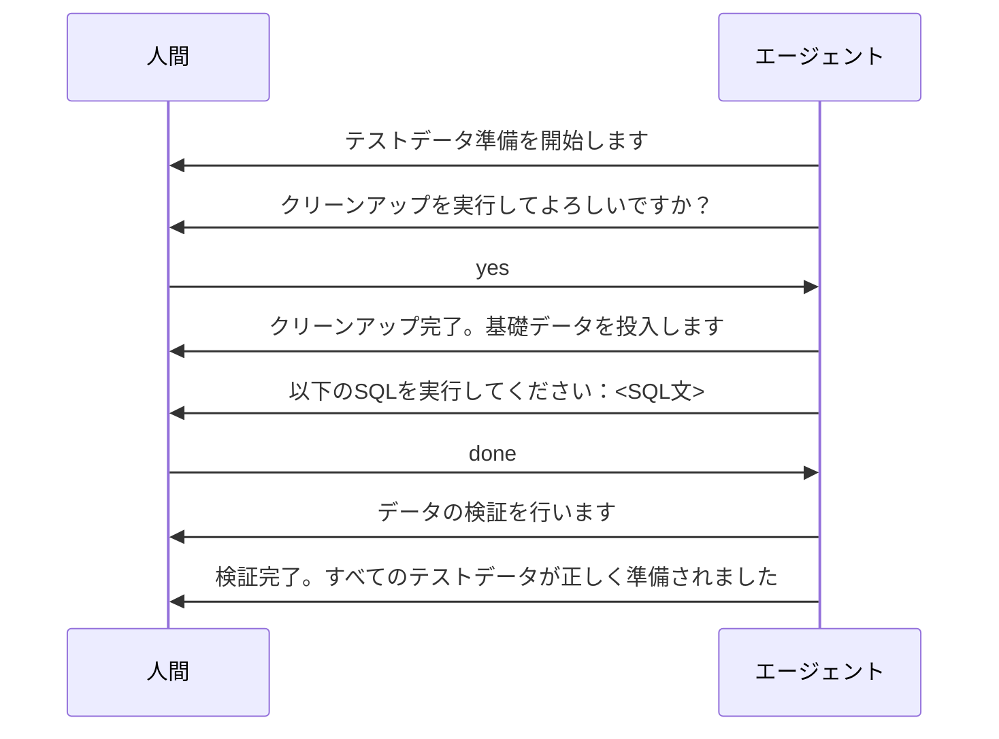
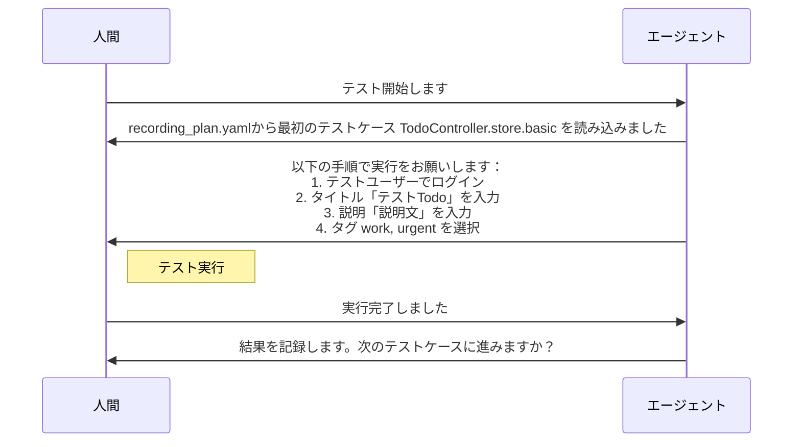

# ソースコード解析ベースの動作記録ワークフロー

## 概要
依存関係YAMLを地図として活用しつつ、実際のソースコードを解析することで、既存システムの動作を正確に記録するためのワークフロー定義です。

## ワークフロー全体図


## 1. 解析対象の特定フェーズ

### 概要
依存関係YAMLから対象コンポーネントとその関連コンポーネントを特定し、解析順序を決定します。

### 入力
- 依存関係YAML
- 対象コンポーネント名

### 処理内容
1. 指定されたコンポーネントのエントリーポイントを特定
2. 依存関係YAMLから関連コンポーネントを抽出
3. 解析順序の決定

### 出力
- `FLOW/temp/analysis_targets.yaml`

```yaml
# 解析対象の依存関係と実行順序を定義
# このファイルを基に、どのコンポーネントをどの順序で解析するかを決定
analysis_targets:
  # エントリーポイントとなるコンポーネント
  entry_point: app/Http/Controllers/TodoController.php
  # 関連する依存コンポーネント
  dependencies:
    - app/Services/TodoService.php
    - app/Models/Todo.php
    - app/Models/Tag.php
    - app/Policies/TodoPolicy.php
  
  # メソッドの解析順序（依存の深い順）
  analysis_order:
    1: TodoController.store
    2: TodoPolicy.create
    3: TodoService.store
    4: Todo.save
    5: Todo.tags().attach
```

## 2. ソースコード解析フェーズ

### 概要
特定された対象のソースコードを解析し、実装の詳細を把握します。

### 入力
- 解析対象リスト（analysis_targets.yaml）
- 各ソースコードファイル

### 処理内容
1. **メソッドシグネチャ解析**
   - パラメータ型と制約
   - 戻り値の型
   - アクセス修飾子

2. **実装フロー解析**
   - 制御フロー
   - 例外ハンドリング
   - 認可チェック

3. **データフロー解析**
   - データの変換
   - データベース操作
   - 外部サービス呼び出し

### 出力
- `FLOW/temp/code_analysis.yaml`

```yaml
# ソースコード解析結果：メソッドの実装詳細を構造化
code_analysis:
  TodoController.store:
    # メソッドのシグネチャ情報
    signature:
      parameters:
        - name: request
          type: StoreTodoRequest
      return_type: TodoResource
    
    # 実装フローの詳細
    flow:
      - type: authorization
        policy: TodoPolicy.create
      - type: validation
        request: StoreTodoRequest
      - type: service_call
        method: TodoService.store
      - type: response
        resource: TodoResource

  TodoService.store:
    signature:
      parameters:
        - name: data
          type: array
        - name: user
          type: User
      return_type: Todo
    
    flow:
      - type: model_creation
        model: Todo
        fields: [title, description]
      - type: relation
        action: associate
        target: user
      - type: database
        action: save
      - type: conditional
        condition: "data['tags'] exists"
        then:
          - type: relation
            action: attach
            target: tags
```

## 3. 解析結果の構造化フェーズ

### 概要
コード解析の結果を、動作記録に適した形式に構造化します。

### 入力
- コード解析結果（code_analysis.yaml）

### 処理内容
1. 入力パターンの特定
2. 状態変更操作の整理
3. 出力パターンの特定
4. エラーケースの分類

### 出力
- `FLOW/temp/behavior_points.yaml`

```yaml
# テスト観点となる振る舞いのポイントを構造化
behavior_points:
  TodoController.store:
    # 入力値の制約
    inputs:
      request:
        required_fields:
          - title: string
          - description: string|null
          - tags: array|null
    
    # 状態変更の操作
    state_changes:
      database:
        - table: todos
          operation: insert
        - table: todo_tag
          operation: insert
          condition: "tags provided"
    
    # 期待される出力パターン
    outputs:
      success:
        type: TodoResource
        includes: [id, title, description, tags]
      errors:
        - condition: "unauthorized"
          type: AuthorizationException
        - condition: "validation_failed"
          type: ValidationException
```

## 4. 動作記録計画フェーズ

### 概要
構造化された解析結果に基づいて、どの動作パターンを記録すべきか計画します。  
この計画は、各メソッドの正常系と異常系のテスト操作に対して、入力、状態変更、出力の期待値を定義します。

### 入力
- 構造化された解析結果（`behavior_points.yaml`）

### 処理内容
1. 記録すべき動作パターンの特定
2. 入出力パターン・副作用の設計
3. 各テストシナリオの説明文の作成

### 出力
- `/recording_plan.yaml`

```yaml
# 動作記録の計画：各メソッドについて記録すべき動作パターンを定義
# この計画を元に、Cursorエージェントがテスト操作の指示を出します
recording_plan:
  TodoController.store:
    # 正常系の記録計画
    normal_patterns:
      basic:
        description: "基本的なTodo作成の動作を記録"
        input_pattern:
          title: "テストTodo"
          description: "説明文"
          tags: [1, 2]
      
        verify_state_changes:
          - target: database.todos
            type: insert
            fields: [title, description, user_id]
          
          - target: database.todo_tag
            type: insert
            fields: [todo_id, tag_id]
        
        verify_output:
          - status: 201
          - response_structure: [id, title, description, tags]
    
    # 異常系の記録計画
    error_patterns:
      unauthorized:
        description: "権限のないユーザーによる操作の検証"
        input_pattern:
          title: "テストTodo"
        verify_output:
          - status: 403
          - error_message: "This action is unauthorized."
      
      validation:
        description: "バリデーションエラー時の動作を検証"
        input_pattern:
          title: ""  # 空文字でエラーを意図
        verify_output:
          - status: 422
          - validation_errors: [title]
```

## 5. テストデータ準備フェーズ

### 概要
`recording_plan.yaml` から必要なテストデータを特定し、準備手順を生成します。

### 入力
- `/recording_plan.yaml`
- データベーススキーマ情報

### 処理フロー

1. **必要データの分析**
```yaml
# /temp/required_test_data.yaml
test_data_requirements:
  TodoController.store:
    basic:
      prerequisites:
        # 事前に必要なデータ
        users:
          - role: normal_user
            attributes: [id, name, email]
        tags:
          - ids: [1, 2]
            names: ["work", "urgent"]
      
      verification_data:
        # テスト実行時に必要なデータ
        database:
          todos: empty  # テスト前にテーブルが空である必要あり
          todo_tag: empty
```

2. **データ準備手順の生成**
```yaml
# /temp/data_preparation_steps.yaml
preparation_steps:
  1_cleanup:
    # クリーンアップ手順
    - truncate table todos
    - truncate table todo_tag
  
  2_seed_data:
    # 基礎データの投入
    users:
      - insert into users (name, email) values ('Test User', 'test@example.com')
    tags:
      - insert into tags (name) values ('work')
      - insert into tags (name) values ('urgent')
  
  3_verification:
    # データ準備の検証クエリ
    checks:
      - description: "必要なユーザーが存在すること"
        query: "select * from users where email = 'test@example.com'"
        expected_count: 1
      
      - description: "必要なタグが存在すること"
        query: "select * from tags where name in ('work', 'urgent')"
        expected_count: 2
```

3. **準備手順の実行**


### エラーハンドリング

1. **データ準備失敗時**
```yaml
error_handling:
  data_preparation_failed:
    # 準備失敗時の対応手順
    steps:
      1. 失敗したステップの特定
      2. エラーログの収集
      3. 手動修正手順の提示
    
    recovery_options:
      - retry_step: "失敗したステップのみを再実行"
      - reset_all: "すべてのデータをリセットして最初から"
      - manual_fix: "手動での修正後、検証から再開"
```

2. **データ不整合検出時**
```yaml
verification_error:
  missing_user:
    fix_sql: "insert into users ..."
  invalid_tag_count:
    fix_sql: "insert into tags ..."
```

### テストデータの状態管理

```yaml
# /temp/test_data_state.yaml
current_state:
  timestamp: "2024-03-15 10:00:00"
  status: ready|preparing|error
  
  tables:
    users:
      count: 1
      test_records:
        - id: 1
          email: "test@example.com"
    
    tags:
      count: 2
      test_records:
        - id: 1
          name: "work"
        - id: 2
          name: "urgent"
  
  verification_status:
    all_checks_passed: true
    last_verified: "2024-03-15 10:00:00"
```

### 利点

1. **準備の自動化**
   - 必要なデータを自動で特定
   - クリーンアップと投入を系統的に実行
   - 検証ステップによる確実性

2. **状態の可視化**
   - 現在のデータ状態が明確
   - 問題発生時の原因特定が容易
   - 手動修正時の指針として活用可能

3. **再現性の確保**
   - 準備手順が明確に文書化
   - いつでも同じ状態に復元可能
   - チーム内での共有が容易

このフェーズを追加することで、テストデータの準備が体系的かつ確実に行えるようになり、テスト実行時の不確実性を減らすことができます。 

## 6. 動作記録フェーズ

### 概要
`/recording_plan.yaml` に基づき、エージェントの指示のもとでテストを実施し、その結果を記録します。

### 入力
- 動作記録計画（`/recording_plan.yaml`）
- テストデータの状態（`/temp/test_data_state.yaml`）

### 基本的な対話フロー



### 記録内容の例

```yaml
# /recorded_behaviors.yaml
recorded_behaviors:
  TodoController.store:
    test_cases:
      basic:
        # テストケースの実行記録
        execution:
          executed_at: "2024-03-15 10:05:00"
          status: completed
        
        # 実際の入力値
        input:
          title: "テストTodo"
          description: "説明文"
          tags: [1, 2]
        
        # 確認された結果
        result:
          status: 201
          response:
            id: 1
            title: "テストTodo"
            description: "説明文"
            tags: [
              {id: 1, name: "work"},
              {id: 2, name: "urgent"}
            ]
```

### エラー発生時の対応

1. **準備段階での問題**
```yaml
Human: "テストデータの準備ができていません"
Agent: "分かりました。必要なデータを確認します：
       - テストユーザー
       - タグ（work, urgent）
       準備ができましたら、お知らせください"
```

2. **実行時の問題**
```yaml
Human: "エラーが発生しました"
Agent: "分かりました。エラーの状況を教えていただけますか？
       - どの手順で発生したか
       - エラーメッセージの内容
       を確認させてください"
```

### 記録時の注意点

1. **必要な情報**
   - 実行した操作の具体的な内容
   - 実際の入力値
   - 得られた結果（レスポンス、画面表示など）
   - エラーが発生した場合はその内容

2. **記録のタイミング**
   - 各テストケース完了時に記録
   - エラー発生時は状況を詳細に記録

## レビューポイント

### 解析結果の確認（Review1）
1. **解析の網羅性**
   - すべての重要なメソッドが解析されているか
   - データフローの追跡が適切か
   - エラーケースが漏れなく特定されているか

2. **動作記録の正確性**
   - 入力パターンの十分性
   - 状態変更の記録の完全性
   - 出力パターンの正確性

## レビュー実施のガイドライン
1. 各レビューでは、実装の詳細に基づいて判断
2. コードの振る舞いと記録内容の整合性を重視
3. レビュー結果は`FLOW/review_logs.yaml`に記録

```yaml
review_checkpoint:
  timing: "解析フェーズ完了後"
  required_roles:
    - テックリード
    - アーキテクト
  focus_points:
    - "実装詳細との整合性"
    - "解析の網羅性"
    - "動作記録の正確性"
  output:
    format: yaml
    location: "FLOW/review_logs.yaml"
```