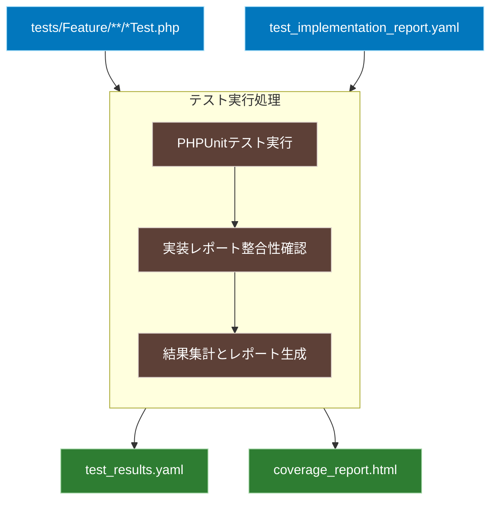

# 仕様化テスト実行ワークフロー

## 概要
実装されたテストコードを実行し、その結果と実装レポートの整合性を確認します。また、コードカバレッジ情報を収集・分析します。

## ワークフロー全体図


## 入力
1. テストコード
   - `tests/Feature/**/*Test.php`
   - PHPUnitで実行可能な形式のテストファイル群

2. 実装レポート
   - `FLOW/output/test_implementation_report.yaml`
   - 実装されたテストケースの情報と期待される実行結果

## 処理内容
1. PHPUnitテスト実行
   - テストの実行
     ```bash
     vendor/bin/phpunit \
       --testdox \                # 読みやすい形式でテスト結果を出力
       --coverage-html coverage \ # HTMLカバレッジレポートを生成
       --log-junit test-results.xml  # JUnit形式でテスト結果を出力
     ```
   - 実行結果の収集
   - カバレッジ情報の収集

2. 実装レポート整合性確認
   - テストケース数の一致確認
   - テストメソッド名の命名規則確認
   - 優先度に基づく実行順序の検証
   - 実行結果と期待結果の比較

3. 結果集計とレポート生成
   - テスト実行結果の構造化（`test_results.yaml`）
     ```yaml
     test_execution:
       # テスト実行の基本情報
       timestamp: "2024-03-20T10:30:00Z"  # 実行日時
       summary:
         total_tests: 15      # 実行されたテストの総数
         passed: 14          # 成功したテスト数
         failed: 1           # 失敗したテスト数
         skipped: 0         # スキップされたテスト数
       
       # 個々のテストケースの実行結果
       test_cases:
         - name: "test_successful_login_maintains_recorded_behavior"
           status: "passed"  # テストの実行結果
           duration: "0.123s"  # 実行時間
           assertions: 3      # 実行された検証の数
           
         - name: "test_invalid_login_maintains_recorded_behavior"
           status: "failed"
           duration: "0.089s"
           assertions: 3
           error:
             message: "Failed asserting response status..."  # エラーメッセージ
             trace: [...]  # エラーのスタックトレース
       
       # 実装レポートとの整合性検証
       implementation_verification:
         matching_rate: 93.3%  # 実装レポートで定義されたテストとの一致率
         missing_tests: []     # 実装レポートにあるが実行されなかったテスト
         unexpected_tests: []  # 実装レポートにないが実行されたテスト
         naming_violations: [] # 命名規則違反のテスト
     ```

   このレポートは以下の情報を追跡します：

   1. **実行の基本情報**
      - 実行日時：テストが実行された時点
      - 実行結果の要約：成功、失敗、スキップの数

   2. **テストケースの詳細**
      - テスト名：動作記録との対応を示す命名
      - 実行状態：成功/失敗/スキップ
      - 実行時間：パフォーマンスの参考指標
      - 検証数：実行された検証の数
      - エラー情報：失敗時の詳細な情報

   3. **実装との整合性**
      - 一致率：実装レポートとの対応度
      - 漏れ：未実行のテスト
      - 想定外：計画外のテスト
      - 規則違反：命名規則に従っていないテスト

このレポート形式により、テストの実行結果と実装の整合性を具体的な指標とともに追跡することができます。

## 出力
- テスト実行結果（`FLOW/output/test_results.yaml`）