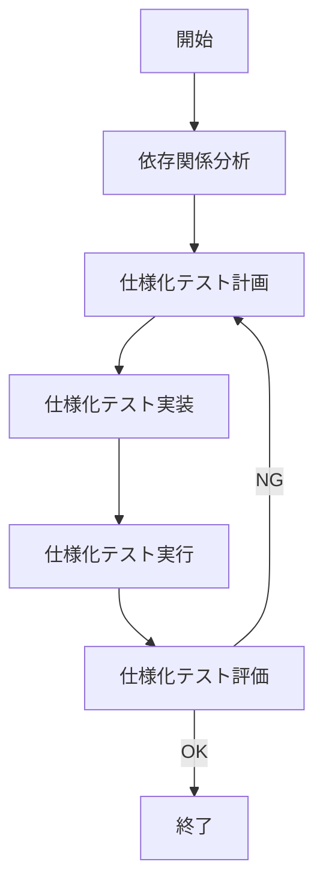

# 仕様化テストメインワークフロー

## 概要
依存性注入リファクタリングの安全性を確保するための仕様化テスト作成ワークフロー

## 前提条件
- リファクタリング対象のコードが特定されていること

## フェーズ

## 1. 依存関係分析フェーズ
- 目的：リファクタリング対象コードの依存関係を分析し、テスト戦略を決定する
- サブワークフロー：WORKFLOW_SPEC_TEST_DI_ANALYZE.md
- 主な分析項目：
  - 依存関係グラフの構築
  - 結合度・凝集度の計算
  - コード特性の分析
  - レイヤー分析
- 出力：
  - 依存関係分析レポート
  - リファクタリング候補の提案
  - テスト要件の初期評価

## 2. 仕様化テスト計画フェーズ
- 目的：既存コードの動作を観察・記録し、テスト実装の計画を立てる
- サブワークフロー：
  1. 観察計画 (WORKFLOW_OBSERVATION_PLAN_DI.md)
  2. 動作記録 (WORKFLOW_BEHAVIOR_RECORDING_DI.md)
  3. テスト環境設計 (WORKFLOW_TEST_ENV_DESIGN_DI.md)
  4. テスト実装計画 (WORKFLOW_TEST_IMPL_PLAN_DI.md)

## 3. 仕様化テスト実装フェーズ
- 目的：計画に基づいて仕様化テストを実装する
- 入力：仕様化テスト計画の成果物
- 出力：仕様化テストコード

## 4. 仕様化テスト実行フェーズ
- 目的：実装したテストを実行し、既存の動作を正しく検証できることを確認
- 入力：仕様化テストコード
- 出力：テスト実行結果

## 5. 仕様化テスト評価フェーズ
- 目的：仕様化テストが十分な品質であることを確認
- 評価基準：
  - 既存の動作を正確に検証できているか
  - すべての観察対象をカバーしているか
  - テストの再現性は確保されているか

## 次のフェーズへ
- すべての評価基準を満たした場合、依存性注入リファクタリングフェーズへ移行
- 基準を満たさない場合、必要なフェーズに戻って改善
