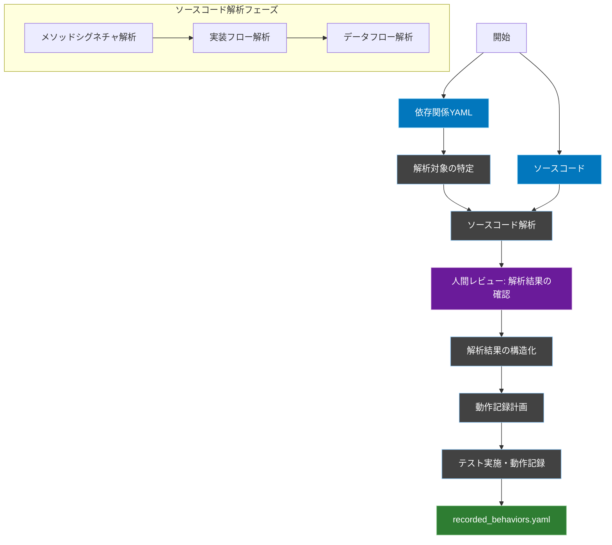
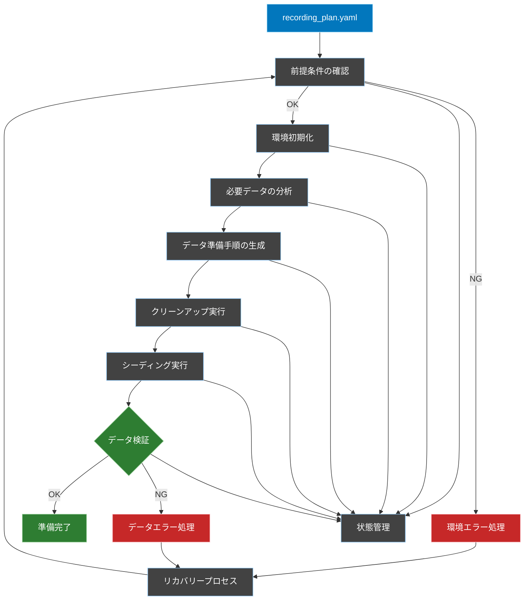
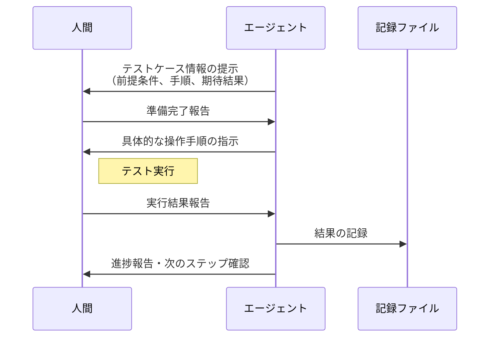

# ソースコード解析ベースの動作記録ワークフロー

## 概要
依存関係YAMLを地図として活用しつつ、実際のソースコードを解析することで、既存システムの動作を正確に記録するためのワークフロー定義です。

## ワークフロー全体図


## 1. 解析対象の特定フェーズ

### 概要
依存関係YAMLから対象コンポーネントとその関連コンポーネントを特定し、解析順序を決定します。

### 入力
- 依存関係YAML
- 対象コンポーネント名

### 処理内容
1. 指定されたコンポーネントのエントリーポイントを特定
2. 依存関係YAMLから関連コンポーネントを抽出
3. 解析順序の決定

### 出力
- `FLOW/temp/analysis_targets.yaml`

```yaml
# 解析対象の依存関係と実行順序を定義
# このファイルを基に、どのコンポーネントをどの順序で解析するかを決定
analysis_targets:
  # エントリーポイントとなるコンポーネント
  entry_point: app/Http/Controllers/TodoController.php
  # 関連する依存コンポーネント
  dependencies:
    - app/Services/TodoService.php
    - app/Models/Todo.php
    - app/Models/Tag.php
    - app/Policies/TodoPolicy.php
  
  # メソッドの解析順序（依存の深い順）
  analysis_order:
    1: TodoController.store
    2: TodoPolicy.create
    3: TodoService.store
    4: Todo.save
    5: Todo.tags().attach
```

## 2. ソースコード解析フェーズ

### 概要
特定された対象のソースコードを解析し、実装の詳細を把握します。

### 入力
- 解析対象リスト（analysis_targets.yaml）
- 各ソースコードファイル

### 処理内容
1. **メソッドシグネチャ解析**
   - パラメータ型と制約
   - 戻り値の型
   - アクセス修飾子

2. **実装フロー解析**
   - 制御フロー
   - 例外ハンドリング
   - 認可チェック

3. **データフロー解析**
   - データの変換
   - データベース操作
   - 外部サービス呼び出し

### 出力
- `FLOW/temp/code_analysis.yaml`

```yaml
# ソースコード解析結果：メソッドの実装詳細を構造化
code_analysis:
  TodoController.store:
    # メソッドのシグネチャ情報
    signature:
      parameters:
        - name: request
          type: StoreTodoRequest
      return_type: TodoResource
    
    # 実装フローの詳細
    flow:
      - type: authorization
        policy: TodoPolicy.create
      - type: validation
        request: StoreTodoRequest
      - type: service_call
        method: TodoService.store
      - type: response
        resource: TodoResource

  TodoService.store:
    signature:
      parameters:
        - name: data
          type: array
        - name: user
          type: User
      return_type: Todo
    
    flow:
      - type: model_creation
        model: Todo
        fields: [title, description]
      - type: relation
        action: associate
        target: user
      - type: database
        action: save
      - type: conditional
        condition: "data['tags'] exists"
        then:
          - type: relation
            action: attach
            target: tags
```

## 3. 解析結果の構造化フェーズ

### 概要
コード解析の結果を、動作記録に適した形式に構造化します。

### 入力
- コード解析結果（code_analysis.yaml）

### 処理内容
1. 入力パターンの特定
2. 状態変更操作の整理
3. 出力パターンの特定
4. エラーケースの分類

### 出力
- `FLOW/temp/behavior_points.yaml`

```yaml
# テスト観点となる振る舞いのポイントを構造化
behavior_points:
  TodoController.store:
    # 入力値の制約
    inputs:
      request:
        required_fields:
          - title: string
          - description: string|null
          - tags: array|null
    
    # 状態変更の操作
    state_changes:
      database:
        - table: todos
          operation: insert
        - table: todo_tag
          operation: insert
          condition: "tags provided"
    
    # 期待される出力パターン
    outputs:
      success:
        type: TodoResource
        includes: [id, title, description, tags]
      errors:
        - condition: "unauthorized"
          type: AuthorizationException
        - condition: "validation_failed"
          type: ValidationException
```

## 4. 動作記録計画フェーズ

### 概要
構造化された解析結果に基づいて、どの動作パターンを記録すべきか計画します。  
この計画は、各メソッドの正常系と異常系のテスト操作に対して、入力、状態変更、出力の期待値を定義します。

### 入力
- 構造化された解析結果（`behavior_points.yaml`）

### 処理内容
1. 記録すべき動作パターンの特定
2. 入出力パターン・副作用の設計
3. 各テストシナリオの説明文の作成

### 出力
- `/recording_plan.yaml`

```yaml
# 動作記録の計画：各メソッドについて記録すべき動作パターンを定義
# この計画を元に、Cursorエージェントがテスト操作の指示を出します
recording_plan:
  TodoController.store:
    # 正常系の記録計画
    normal_patterns:
      basic:
        description: "基本的なTodo作成の動作を記録"
        input_pattern:
          title: "テストTodo"
          description: "説明文"
          tags: [1, 2]
      
        verify_state_changes:
          - target: database.todos
            type: insert
            fields: [title, description, user_id]
          
          - target: database.todo_tag
            type: insert
            fields: [todo_id, tag_id]
        
        verify_output:
          - status: 201
          - response_structure: [id, title, description, tags]
    
    # 異常系の記録計画
    error_patterns:
      unauthorized:
        description: "権限のないユーザーによる操作の検証"
        input_pattern:
          title: "テストTodo"
        verify_output:
          - status: 403
          - error_message: "This action is unauthorized."
      
      validation:
        description: "バリデーションエラー時の動作を検証"
        input_pattern:
          title: ""  # 空文字でエラーを意図
        verify_output:
          - status: 422
          - validation_errors: [title]
```

## 5. テストデータ準備フェーズ

### 概要
`recording_plan.yaml`から必要なテストデータを特定し、準備手順を生成・実行します。

### プロセス全体図


### 前提条件の確認
1. **環境変数の確認**
```bash
# 環境設定の確認コマンド
pwd  # カレントディレクトリの確認
php artisan env  # 環境設定の確認
```

2. **データベース接続の確認**
```bash
# データベース接続テストコマンド
php artisan db:show  # データベース設定の確認
```

### ディレクトリ構造の管理
```yaml
# directory_state.yaml
workspace:
  root: "/path/to/workspace"
  laravel_root: "/path/to/workspace/laravel"
  current: "/current/path"  # 現在のディレクトリを常に追跡
```

### データ準備プロセス

1. **必要データの分析**
```yaml
# /temp/required_test_data.yaml
test_data_requirements:
  # テストケースごとのデータ要件を定義
  test_case_name:
    prerequisites:
      tables:
        - name: "table_name"
          required_records:
            - fields: {...}
              constraints: {...}
```

2. **データ準備手順の生成**
```yaml
# /temp/data_preparation_steps.yaml
preparation_steps:
  # 各ステップの実行コマンドを定義
  steps:
    - id: "cleanup"
      type: "sql"
      command: "TRUNCATE TABLE ..."
      verify: "SELECT COUNT(*) FROM ..."
    
    - id: "seed_data"
      type: "artisan"
      command: "php artisan db:seed --class=..."
      verify: "php artisan tinker --execute='...'"
```

3. **検証クエリの標準化**
```yaml
# /temp/verification_queries.yaml
verification:
  queries:
    # テーブルごとの検証クエリを定義
    users:
      count: "SELECT COUNT(*) FROM users"
      validation: "SELECT * FROM users WHERE ..."
    
    relationships:
      integrity: "SELECT ... FROM table1 JOIN table2 ..."
```

### データ検証プロセス

1. **検証コマンドの選択基準**
```yaml
verification_tools:
  # 用途に応じた検証ツールの使い分け
  simple_queries:
    tool: "mysql"
    when: "単純なSELECTクエリの実行時"
    template: "mysql -u [user] -p'[pass]' [db] -e '[query]'"
  
  model_verification:
    tool: "artisan"
    when: "Eloquentモデル経由での検証時"
    template: "php artisan tinker --execute='[query]'"
  
  complex_verification:
    tool: "custom_script"
    when: "複雑な検証ロジックが必要な時"
    template: "php artisan test --filter=[test]"
```

2. **検証チェックリスト**
```yaml
verification_checklist:
  database:
    - テーブルが存在すること
    - 必要なレコードが存在すること
    - 関連付けが正しいこと
  
  data_integrity:
    - 外部キー制約が満たされていること
    - ユニーク制約が満たされていること
    - NULL制約が満たされていること
```

### エラーハンドリング

1. **一般的なエラーと対処方法**
```yaml
error_handling:
  directory_errors:
    - error: "No such file or directory"
      check: "pwd && ls -la"
      fix: "cd [correct_path]"
  
  database_errors:
    - error: "Connection refused"
      check: "php artisan db:show"
      fix: "データベース接続設定の確認"
```

2. **リカバリープロセス**
```yaml
recovery_process:
  steps:
    1. 現在の状態を保存
    2. エラーの原因を特定
    3. クリーンアップを実行
    4. 準備プロセスを再実行
```

### 状態管理

```yaml
# /temp/test_data_state.yaml
current_state:
  timestamp: "YYYY-MM-DD HH:mm:ss"
  status: "preparing|ready|error"
  
  environment:
    current_directory: "/path/to/current"
    database_connection: "verified"
  
  tables:
    table_name:
      count: 0
      last_verified: "YYYY-MM-DD HH:mm:ss"
      status: "ready|error"
```

### ベストプラクティス

1. **ディレクトリ管理**
   - 作業開始時に必ずカレントディレクトリを確認
   - 相対パスではなく絶対パスを使用
   - ディレクトリ変更時は状態を記録

2. **データベース操作**
   - 単純なクエリはMySQLクライアントを使用
   - モデル関連の検証はArtisanコマンドを使用
   - 複雑な検証はカスタムスクリプトを作成

3. **エラー防止**
   - コマンド実行前に前提条件を確認
   - 各ステップで検証を実行
   - エラー発生時は状態を記録

### 実行例

```bash
# 1. 環境確認
pwd  # カレントディレクトリの確認
php artisan env  # 環境設定の確認

# 2. データベースクリーンアップ
mysql -u [user] -p'[pass]' [db] -e "
  TRUNCATE TABLE tag_todo;
  TRUNCATE TABLE tags;
  TRUNCATE TABLE todos;
  TRUNCATE TABLE users;
"

# 3. シーディング実行
php artisan db:seed

# 4. データ検証
mysql -u [user] -p'[pass]' [db] -e "
  SELECT COUNT(*) FROM users;
  SELECT COUNT(*) FROM tags;
  SELECT COUNT(*) FROM todos;
  SELECT COUNT(*) FROM tag_todo;
"
```

## 6. 動作記録フェーズ

### 概要
`/recording_plan.yaml` に基づき、エージェントの指示のもとでテストを実施し、その結果を記録します。各テストケース実行後は必ず進捗報告を行い、次のステップに進みます。

### 入力
- 動作記録計画（`/recording_plan.yaml`）
- テストデータ（準備フェーズで用意）

### テスト実行の基本フロー



### テストケース指示フォーマット

```yaml
test_instruction:
  case_id: "TodoController.store.basic"
  
  # 前提条件の詳細
  prerequisites:
    database:
      - "users テーブルにテストユーザーが存在すること"
      - "tags テーブルに 'work', 'urgent' タグが存在すること"
    auth:
      - "テストユーザーでログインしていること"
  
  # 具体的な操作手順
  steps:
    1:
      action: "「新規Todo作成」ボタンをクリック"
      location: "画面右上の緑色のボタン"
    2:
      action: "タイトル入力"
      value: "テストTodo"
      field_location: "フォームの最上部のテキストフィールド"
    3:
      action: "説明文入力"
      value: "説明文"
      field_location: "タイトルフィールドの下のテキストエリア"
    4:
      action: "タグ選択"
      value: ["work", "urgent"]
      field_location: "説明文フィールドの下のマルチセレクトボックス"
    5:
      action: "保存ボタンクリック"
      location: "フォーム下部の青色のボタン"
  
  # 期待される結果
  expected_results:
    response:
      status: 201
      body:
        - "id が数値であること"
        - "title が 'テストTodo' であること"
        - "description が '説明文' であること"
        - "tags に work, urgent が含まれること"
    database:
      todos:
        - "新しいレコードが追加されていること"
      tag_todo:
        - "新しいTodoと選択したタグの関連レコードが追加されていること"
```

### エラーケース指示フォーマット

```yaml
error_test_instruction:
  case_id: "TodoController.store.validation_error"
  
  # エラー再現のための具体的手順
  steps:
    1:
      action: "「新規Todo作成」ボタンをクリック"
      location: "画面右上の緑色のボタン"
    2:
      action: "タイトルを空のまま保存"
      detail: "タイトルフィールドに何も入力せず、他のフィールドも空の状態で保存ボタンをクリック"
  
  # 期待されるエラー状態
  expected_error:
    response:
      status: 422
      messages:
        title: "タイトルは必須です"
    ui:
      - "タイトルフィールドが赤枠で強調表示されること"
      - "フィールド下部にエラーメッセージが表示されること"
```

### 進捗報告フォーマット

```yaml
progress_report:
  case_id: "TodoController.store.basic"
  status: "completed"  # completed, failed, skipped
  execution_time: "2024-03-15 10:05:00"
  
  # テスト結果の要約
  result_summary:
    success: true
    notes: "期待通りの動作を確認"
  
  # 次のステップ
  next:
    case_id: "TodoController.store.validation_error"
    type: "error_case"
```

### 記録内容の例

```yaml
# /recorded_behaviors.yaml
recorded_behaviors:
  TodoController.store:
    test_cases:
      basic:
        execution:
          executed_at: "2024-03-15 10:05:00"
          status: "completed"
          executor: "test_user_1"
        
        input:
          title: "テストTodo"
          description: "説明文"
          tags: [1, 2]
        
        result:
          status: 201
          response:
            id: 1
            title: "テストTodo"
            description: "説明文"
            tags: [
              {id: 1, name: "work"},
              {id: 2, name: "urgent"}
            ]
        
        verification:
          database:
            todos:
              - record_found: true
                matches_input: true
            tag_todo:
              - relationships_created: true
                tag_count: 2
```

### 実行時の注意事項

1. **テストケース開始時**
   - 前提条件の確認を必ず実施
   - 必要なテストデータの存在を確認
   - ブラウザの状態（ログイン状態等）を確認

2. **テスト実行中**
   - 各ステップの実行結果を即時確認
   - 想定外の動作が発生した場合は即時報告
   - スクリーンショットなどの証跡を必要に応じて保存

3. **テストケース完了時**
   - 結果の記録を漏れなく実施
   - 進捗報告を必ず実施
   - 次のテストケースの準備状態を確認

## レビューポイント

### 解析結果の確認（Review1）
1. **解析の網羅性**
   - すべての重要なメソッドが解析されているか
   - データフローの追跡が適切か
   - エラーケースが漏れなく特定されているか

2. **動作記録の正確性**
   - 入力パターンの十分性
   - 状態変更の記録の完全性
   - 出力パターンの正確性

## レビュー実施のガイドライン
1. 各レビューでは、実装の詳細に基づいて判断
2. コードの振る舞いと記録内容の整合性を重視
3. レビュー結果は`FLOW/review_logs.yaml`に記録

```yaml
review_checkpoint:
  timing: "解析フェーズ完了後"
  required_roles:
    - テックリード
    - アーキテクト
  focus_points:
    - "実装詳細との整合性"
    - "解析の網羅性"
    - "動作記録の正確性"
  output:
    format: yaml
    location: "FLOW/review_logs.yaml"
```